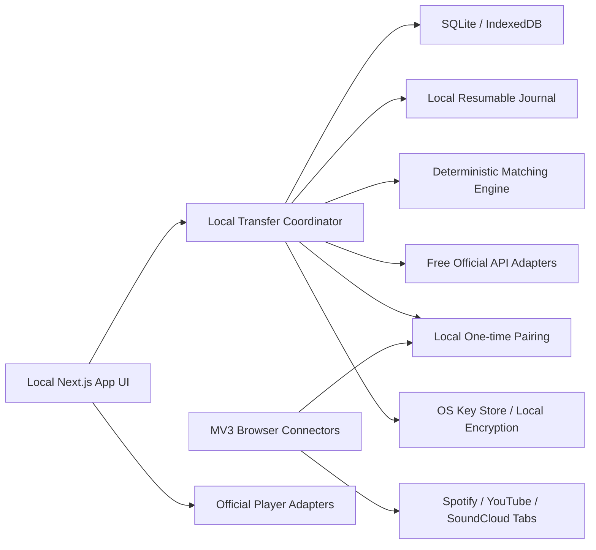

# Plan_Playlist-Transfer — план реализации приложения переноса плейлистов

> Тип артефакта: только план. Этот документ не содержит реализации приложения, исходного кода, конфигурации или прототипа.
>
> Версия требований и внешних ограничений: 29 июля 2026 года.

## 0. Жёсткое условие: нулевой бюджет

Обязательный результат этого плана — бесплатная local-first версия. Для её установки и ежедневной работы нельзя требовать:

- Spotify Premium;
- SoundCloud Artist Pro;
- платный hosting/domain;
- managed PostgreSQL/Redis/object storage/KMS;
- платные AI/ML, search или proxy APIs;
- покупку расширенной квоты;
- платную публикацию расширения;
- отдельный постоянно работающий сервер.

Допустимые исходные предпосылки: компьютер пользователя, Chrome или Edge, интернет и уже существующие бесплатные аккаунты Spotify, SoundCloud и Google/YouTube. Все обязательные компоненты должны быть open-source либо входить в бесплатные возможности браузера/ОС.

Основной delivery profile:

1. локальное Next.js/React-приложение либо его статически собранная desktop/PWA-оболочка;
2. единое MV3-расширение Chrome/Edge, работающее только после явного действия пользователя на доменах сервисов;
3. локальная база SQLite или IndexedDB;
4. локальный resumable job journal вместо облачной очереди;
5. поиск и запись через бесплатный официальный API, если он доступен без обязательной оплаты, иначе через разрешённый видимый браузерный UI connector или guided workflow;
6. guided manual fallback, если автоматизация не может безопасно распознать текущее состояние страницы.

Бесплатная версия считается персональным/local tool. Публичный многопользовательский SaaS не является обязательным условием её завершения: у Spotify и SoundCloud нет гарантированного бесплатного официального пути для такого масштаба. Hosted/public profile остаётся необязательным будущим этапом и не может делать бесплатную local-first версию платной.

«Подходят любые способы» означает использовать все бесплатные технически и договорно допустимые уровни — официальный API, официальный embed, guided workflow и, после отдельного provider-policy gate, DOM connector/видимую UI automation. Это по-прежнему не включает кражу/извлечение cookies и токенов, перехват внутренних API credentials, обход CAPTCHA/DRM/квот, stream ripping или скрытые действия от имени пользователя.

## 1. Цель и границы результата

Нужно создать приложение Plan_Playlist-Transfer, которое переносит выбранные пользователем собственные и, где provider даёт проверяемую write/read capability, collaborative-плейлисты между Spotify, SoundCloud и YouTube/YouTube Music. Пользователь подключает аккаунты через официальную страницу OAuth, когда бесплатный официальный доступ существует, либо подтверждает уже открытую авторизованную вкладку сервиса; затем выбирает один или несколько исходных плейлистов, назначение, режим переноса и настройки точности, после чего получает проверяемый результат и отчёт.

Целевая сущность всегда должна реально существовать в сервисе назначения:

| Сервис назначения | Что фактически добавляется |
|---|---|
| Spotify | Spotify track URI/ID |
| SoundCloud | SoundCloud track URN/permalink |
| YouTube/YouTube Music | конкретный YouTube videoId |

Внутренняя «каноническая песня» допустима только как временная модель для поиска и сравнения. Она никогда не подменяет реальную сущность назначения. Для YouTube итог поиска, решения пользователя, записи и отчёта — именно videoId.

Фраза «достичь цели любой ценой, но бесплатно» в этом плане означает не отказываться от функции из-за отсутствия платного API: для неё проектируется бесплатный локальный browser-assisted путь и честный manual fallback. Она не означает извлечение cookies, внутренних client_id или токенов, обход CAPTCHA/DRM/квот, stream ripping либо использование недокументированных YouTube Music endpoints.

### 1.1. Обязательный функциональный объём

- Все шесть направлений между тремя сервисами: Spotify ↔ SoundCloud, Spotify ↔ YouTube, SoundCloud ↔ YouTube.
- Выбор одного или нескольких исходных плейлистов.
- Только собственные или действительно collaborative-плейлисты; произвольные чужие public/followed/liked плейлисты исключаются.
- Три режима назначения:
  1. создать отдельную копию для каждого исходного плейлиста;
  2. объединить все выбранные плейлисты в один новый плейлист;
  3. добавить все выбранные треки в один существующий доступный для записи плейлист.
- Перенос порядка, названия, описания, privacy и обложки в той мере, в которой это разрешают API, права пользователя и правила сервиса.
- Настройки каждого переноса: безопасный/рискованный режим, обязательное ручное сверение сомнительных совпадений, сохранение повторов, сохранение порядка, поведение при недоступных треках и конфликте размера.
- Поэтапный детерминированный поиск по названию, исполнителю/загрузившему, длительности, ISRC и признакам версии.
- Окно сверения с оригиналом, несколькими лучшими кандидатами и воспроизведением примерно с отметки 25%, когда это технически и договорно разрешено.
- Возобновляемый фоновый перенос, защита от повторной записи и проверка результата чтением из сервиса назначения.
- Итоговый отчёт: добавлено, подтверждено вручную, добавлено рискованно, пропущено, недоступно, ошибка записи, изменённые метаданные.

### 1.2. Не входит в объём

- Перенос скачанных аудиофайлов, local uploads или Spotify local files.
- Подкасты, эпизоды и иные не-музыкальные сущности в Spotify.
- Копирование владельца, подписчиков, дат создания, состава collaborators и внутренних рекомендационных данных.
- Гарантия «100% та же запись» без проверки пользователя: такая гарантия невозможна при ошибочных исходных метаданных и пользовательских загрузках.
- Обучение ML/AI-моделей, embeddings, LLM-анализ или audio fingerprinting на контенте Spotify/SoundCloud.
- Автоматический обход CAPTCHA, геоблокировок, private access или ограничений воспроизведения.
- Обязательный публичный многопользовательский SaaS: zero-budget Definition of Done относится к guided local personal baseline; полный DoD неизменённого исходного UX дополнительно требует strict gates из раздела 22.

## 2. Проверка реализуемости и обязательные продуктовые оговорки

До разработки нужно зафиксировать не рекламное обещание, а фактические возможности интеграций.

| Направление | Реализуемый официальный путь | Критическое ограничение |
|---|---|---|
| Spotify | Web API, OAuth 2.0, новые playlist endpoints /items | Требует Premium у владельца Development app; гарантированный бесплатный fallback — user-operated guided transfer по реальным share URL/track ID |
| SoundCloud | Self-service API только для Artist Pro, OAuth 2.1 + PKCE | Artist Pro платный; гарантированный бесплатный fallback — permalink + oEmbed + guided transfer |
| YouTube Music | Бесплатная default quota YouTube Data API v3; плейлист состоит из videoId | Квота принадлежит Cloud project, нет отдельного Music API; fallback — ожидание reset либо ручной выбор watch URL/videoId и Save |
| Browser connector shell | MV3 открывает точные страницы, передаёт явно выбранные пользователем URL и ведёт локальный journal | DOM extraction/autoclick включаются только для provider, у которого это разрешено; unknown state всегда manual |

### 2.1. Точная формулировка поддержки YouTube Music

В интерфейсе можно использовать понятное пользователю название «YouTube Music», но рядом нужно объяснить техническую реальность: приложение создаёт или изменяет YouTube-плейлист и добавляет реальные videoId. Плейлисты отображаются в YouTube и YouTube Music, однако YouTube Music показывает из них только контент, который сам классифицирует как музыкальный.

Продукт может гарантировать:

- существующий и доступный videoId на момент проверки;
- успешное добавление videoId в YouTube-плейлист на момент read-after-write;
- best-effort сохранение порядка вставленных videoId при отсутствии manual-sort/concurrent-edit конфликта и доступной playlist-level метаинформации.

Продукт не может официально гарантировать:

- принадлежность videoId отдельному каталогу YouTube Music;
- появление каждого видео в интерфейсе YouTube Music;
- выбор именно студийной аудиозаписи вместо music video, fan upload или live-версии без пользовательской проверки.

### 2.2. SoundCloud: бесплатный и официальный профили

Исходная предпосылка «официального SoundCloud API нет» устарела, но получение ключа требует платный Artist Pro. Поэтому план содержит три уровня:

- Zero-budget required: local MV3 connector в guided mode открывает точные страницы, принимает выбранные пользователем permalink и подтверждения, использует официальный oEmbed для базовых данных и ведёт journal; DOM не считывается и клики не автоматизируются.
- Experimental accelerator: DOM reader и visible UI writer из раздела 11 включаются только после отдельного policy gate; они не являются единственным способом завершить transfer.
- Official optional: OAuth API используется, если пользователь уже имеет Artist Pro/credentials и это не создаёт обязательной траты.

Бесплатная версия не должна предлагать купить Artist Pro. Если разрешённый browser accelerator перестал понимать страницу, он экспортирует уже собранный JSON как partial, открывает нужные search/add pages и переводит оставшиеся шаги в guided manual mode. Cookies, network responses, внутренние client_id и auth headers не читаются.

Локальная unpacked-сборка сама по себе не создаёт исключения из правил сервиса. DOM extraction и повторяющаяся UI automation остаются отдельным policy gate для любой распространяемой сборки. Без письменного разрешения default release использует oEmbed/permalink/guided workflow; экспериментальный DOM-код хранится отдельным feature flag, выключенным в release. План всегда показывает предупреждение о нестабильности и ограничениях правил сервиса.

### 2.3. Side-by-side playback — отдельный release gate

Требуемое окно «оригинал слева, конкурентный сервис справа, оба проигрываются внутри приложения» ограничено правилами Spotify и SoundCloud об агрегировании конкурентного контента. Поэтому предусматриваются два режима:

- Full comparison: соседние карточки и официальные встроенные плееры — только для пар сервисов, для которых получено письменное разрешение.
- Compliant sequential review: оригинал и кандидат показываются/проигрываются последовательно, одновременно активен только один сервис; при запрете embed используется прямая ссылка в официальный сервис.

Функция не должна тайно переходить на Web Playback SDK, внутренние потоки или скачанные previews. Без разрешения Spotify/SoundCloud именно sequential review считается production-вариантом.

### 2.4. Бесплатная иерархия способов

Каждая операция выбирает первый доступный бесплатный и разрешённый adapter:

1. Free official API — при наличии бесплатных credentials/quota.
2. Official public embed/oEmbed — для воспроизведения и базовых данных.
3. Local DOM reader — читает только видимое пользователю содержимое, если это разрешено актуальными правилами/письменным согласием.
4. Visible UI writer — открывает страницу, подсвечивает действие и нажимает стандартную кнопку только после подтверждения, если automation разрешена.
5. Guided manual — формирует точный URL, поисковую строку, videoId/track ID и пошагово просит пользователя подтвердить результат.

Уровень adapter и степень автоматизации фиксируются в отчёте. Manual fallback не считается ошибкой: это предусмотренный бесплатный способ закончить transfer без выдуманных треков и без платного API.

Automation не является критерием завершения: критерием служит подтверждённый результат в destination. Если правила provider запрещают DOM/UI automation, тот же immutable write plan исполняется guided-режимом — приложение открывает нужную официальную страницу, пользователь нажимает стандартный control, а приложение принимает или помогает проверить реальный provider ID.

## 3. Правила допустимости плейлистов

Проверка выполняется отдельно для источника и назначения. Обязательная матрица поддержки не маскирует ограничения provider:

| Provider | Owned | Collaborative |
|---|---|---|
| Spotify | обязательно | только при положительной API/UI capability; иначе fail-closed |
| YouTube | обязательно | experimental manual playlistId; вне гарантированного DoD, пока API не доказывает membership |
| SoundCloud | обязательно | не поддерживается, пока provider не предоставляет проверяемую collaborator/write capability |

### 3.1. Spotify

- Считать собственным только плейлист, у которого owner совпадает с текущим Spotify account.
- Считать collaborative только плейлист с collaborative=true, который вернулся пользователю и содержимое которого реально открывается через GET /playlists/{id}/items.
- Followed public playlist без write/read collaborative capability не показывать.
- Перед записью в существующий плейлист повторно проверить modify capability.
- Нельзя копировать список collaborators или назначать конкретных collaborators через Web API.

### 3.2. YouTube

- Автоматически перечислять только owned playlists из playlists.list(mine=true).
- Collaborative UI существует, но Data API не перечисляет membership и не возвращает признак write capability.
- Experimental non-owned mode вне гарантированного DoD: пользователь вручную вставляет URL/playlistId; до первой фактической записи статус `UNVERIFIED_NON_OWNED`, успешный insert даёт только `WRITE_CONFIRMED_NON_OWNED`, но не доказывает collaborator membership; 403 немедленно останавливает job.
- Пока E2E с двумя реальными аккаунтами и API contract не подтвердит поведение, collaborative-плейлист YouTube не рекламируется как гарантированная функция.
- Произвольный public playlist по URL нельзя автоматически признать collaborative; default UI его не допускает, а experimental mode не выдаёт его за collaborative до успешной фактической write capability.

### 3.3. SoundCloud

- API profile: показывать только плейлисты из /me/playlists, у которых playlist.user.urn совпадает с me.urn.
- Guided profile: принимать только playlist, для которого пользователь сверил owner profile URL с активным account и видит edit/manage control; статус — `USER_ATTESTED_OWNED`, не provider-verified.
- Liked/reposted/followed playlists исключить во всех профилях.
- Публичный API не даёт явной collaborative-роли; поэтому SoundCloud поддерживает только owned playlists.
- Collaborative для SoundCloud не заявлять, пока provider не начнёт возвращать проверяемую роль/право записи.

## 4. Пользовательские сценарии и экраны

Интерфейс приложения должен поддерживать два языка: русский и английский. При первом запуске язык интерфейса по умолчанию — русский. В приложении должна быть постоянно доступная кнопка переключения языка между русским и английским; выбранный язык сохраняется локально для следующих запусков.

### 4.1. Регистрация и подключение аккаунтов

В zero-budget edition «регистрация» означает создание локального профиля Plan_Playlist-Transfer на устройстве. Он защищается локальным passkey/WebAuthn или паролем ОС; email/magic-link service не требуется. Spotify, Google/YouTube и SoundCloud подключаются как service connections через бесплатный официальный OAuth, когда он доступен, либо через подтверждение уже открытой пользователем вкладки сервиса.

Поток:

1. Пользователь создаёт локальный профиль без облачной регистрации.
2. Видит три карточки сервисов со статусами «Не подключён», «Подключён», «Нужно повторно войти», «Ограничены права».
3. Нажатие «Подключить» либо открывает официальный OAuth/account chooser, либо просит открыть официальный сайт и выбрать аккаунт там.
4. Extension подтверждает только официальный домен/URL; account label, owner и доступные controls пользователь подтверждает сам, если policy-gated DOM reader выключен. Session secrets не читаются ни в одном режиме.
5. После handoff приложение показывает имя/аватар, тип adapter (API/UI/manual), scopes при наличии OAuth и доступные capability.
6. Дополнительные write scopes запрашиваются только при первом выборе сервиса как назначения, если используется API.
7. Disconnect удаляет локальную связь, credentials и session data; browser session самого сервиса приложение не трогает.

Приложение:

- никогда не показывает собственную форму пароля Spotify/Google/SoundCloud;
- не объединяет аккаунты автоматически по email;
- не передаёт provider token в client-side JavaScript, extension или localStorage, кроме короткоживущего Spotify playback token только в памяти optional approved player component;
- позволяет экспортировать зашифрованную локальную резервную копию настроек; disconnect всех сервисов не влияет на локальный профиль.

Для необязательного hosted profile позже можно добавить passkey-only sync, но бесплатная версия не зависит от email provider, SMS или облачного аккаунта.

### 4.2. Основной мастер переноса

Экран 1 — «Откуда»:

- карточки Spotify, SoundCloud, YouTube Music;
- недоступный сервис объясняет конкретную причину;
- нельзя выбрать одинаковый source и destination.

Экран 2 — «Плейлисты»:

- горизонтальные ряды карточек с обложкой, названием, количеством треков, owner/collaborative badge;
- поиск и сортировка;
- multi-select;
- неподдерживаемые плейлисты скрыты либо disabled с объяснением;
- после выбора показываются общий объём и потенциальные ограничения.

Экран 3 — «Куда»:

- выбор подключённого сервиса назначения;
- при отсутствии write scope — provider-supported scope upgrade либо полное reconnect/reauthorize; для Google installed app нельзя полагаться на incremental authorization;
- выбор конкретного YouTube channel, если Google account управляет несколькими каналами.

Экран 4 — «Способ переноса»:

- «Отдельная копия каждого»;
- «Объединить в новый»;
- «Добавить в существующий»;
- для существующего назначения отображаются owned playlists и только те collaborative candidates, которые provider позволяет проверить; YouTube non-owned collaborative вводится вручную как experimental/unverified и не показывается как заранее подтверждённый.

Экран 5 — «Настройки»:

- Безопасный режим — default.
- Рискованное добавление — off по умолчанию; рядом ясное предупреждение.
- Сверять сомнительные совпадения — on по умолчанию.
- Сохранять повторы — on для режима «копия один в один».
- Сохранять исходный порядок — on.
- Дедупликация при объединении: off / по target ID / по подтверждённой эквивалентности.
- Поведение при пропуске: продолжить и показать отчёт / остановить перед записью.
- Privacy назначения с отдельным подтверждением.
- Обложка: «копировать только если у меня есть права» с явным consent.
- SoundCloud >500 tracks: остановить / разбить на Part 1, Part 2 с подтверждением.

Экран 6 — «Проверка перед запуском»:

- source → destination;
- список и mapping плейлистов;
- режим и настройки;
- ожидаемое число поисков и записей;
- оценка квоты YouTube;
- поля метаданных, которые нельзя перенести;
- предупреждения policy/capability;
- финальная кнопка «Начать поиск».

Экран 7 — «Ход выполнения»:

- этапы: снимок → поиск → оценка → ожидает сверения → запись → проверка;
- общие и per-playlist progress;
- счётчики exact/fuzzy/review/missing;
- понятные состояния rate limit, expired OAuth, quota pause;
- безопасная отмена после текущего атомарного шага.

Экран 8 — «Сверение»:

- исходный трек;
- 3–5 лучших кандидатов с evidence;
- carousel/стрелки;
- одна центральная кнопка подтверждения;
- «Нет совпадения», «Пропустить», «Изменить запрос»;
- воспроизведение с 25% по нажатию пользователя;
- после решения сразу загружается следующая пара;
- клавиатурная навигация и сохранение каждого решения немедленно.

Экран 9 — «Результат»:

- ссылки на созданные/изменённые плейлисты;
- отдельные counts `VERIFIED_PROVIDER`, `USER_CONFIRMED_MANUAL` и unverified/error;
- risky и manual decisions;
- missing/unavailable;
- изменения названия, privacy, cover;
- ошибки, которые можно повторить;
- экспорт краткого отчёта без OAuth secrets.

### 4.3. Дополнительные экраны

- Главная/история: последние transfers без долгого хранения provider content.
- Подключения: scopes, дата авторизации, re-auth, disconnect.
- Настройки данных: удалить историю, удалить аккаунт, скачать технический отчёт.
- Статус SoundCloud extension: установлен, разрешён, payload готов, устарел, отключён kill switch.
- Service status: текущие квоты и временно ограниченные функции.

## 5. Визуальная система

### 5.1. Цвета

| Token | Цвет | Использование |
|---|---|---|
| Onyx | #121212 | основной фон, не менее 70–80% видимой площади |
| Jet Black | #2A2E31 | карточки, панели, поля, меню, вторичные кнопки |
| Bright Snow | #F6F9FA | основной текст, иконки, активные элементы |
| Golden Earth | #99621E | выбранные состояния, primary actions, progress accents |

Проверенные контрастные соотношения:

- Bright Snow / Onyx: примерно 17.71:1.
- Bright Snow / Jet Black: примерно 12.94:1.
- Golden Earth / Onyx: примерно 3.68:1.
- Golden Earth / Jet Black: примерно 2.69:1.
- Bright Snow / Golden Earth: примерно 4.82:1.

Следствия:

- Golden Earth не использовать как мелкий текст на Jet Black.
- Accent-кнопка: фон Golden Earth, текст Bright Snow.
- На Jet Black accent дополнять формой, иконкой или Bright Snow text, а не полагаться только на цвет.
- Secondary text — Bright Snow с контролируемой пониженной яркостью и отдельной WCAG-проверкой.

### 5.2. Геометрия и композиция

- Desktop-first layout: фиксированная левая панель 240–280 px, справа прокручиваемая рабочая область.
- На узких экранах sidebar превращается в icon rail или drawer; review переключается в последовательный режим.
- Карточки: 20–28 px.
- Поля/списки: 16–22 px.
- Модальные окна: 24–32 px.
- Обложки: 12–18 px.
- Кнопки: pill radius 999 px.
- Никаких рамок, glass, blur, glow, прозрачных панелей и теней.
- «Плавание» достигается только контрастом Onyx/Jet Black, скруглением и расстоянием.
- Hover: небольшое изменение масштаба до 1–2% или смена поверхности; без тени.
- Focus-visible: заметная смена заливки, Bright Snow marker и/или Golden Earth underline; отсутствие обычной рамки не отменяет доступный keyboard focus.
- Motion: 120–200 ms, отключается через prefers-reduced-motion.

### 5.3. Review layout

- В разрешённом full comparison режиме: две равные колонки, между ними круглая Golden Earth confirm-кнопка.
- Справа — карточка выбранного кандидата и компактный carousel top-N.
- Одновременно играет только один player; запуск другого автоматически ставит предыдущий на pause.
- YouTube iframe остаётся видимым и не уменьшается ниже требований Player API.
- В compliant sequential режиме те же данные показываются в два последовательных шага, без соседних конкурентных players.

## 6. Целевая архитектура

### 6.1. Технологические решения

- Обязательный профиль: local-first, без внешнего backend.
- Web UI: актуальная стабильная Next.js с App Router и TypeScript, запускаемая локально; допустим статический export внутри desktop/PWA shell.
- Runtime: локальный Node.js либо desktop sidecar; Edge и платные serverless functions не нужны.
- UI: Server Components для начальных чтений; Client Components только для wizard state, carousel, progress и players.
- Внутренние mutations: локальные Server Actions/IPC commands, в зависимости от packaging.
- OAuth callbacks и extension handoff: loopback Route Handlers на 127.0.0.1 либо безопасный extension message channel.
- Фоновая обработка: локальный worker/Web Worker с durable journal; приложение честно просит не закрывать вкладки во время UI steps и возобновляет работу после перезапуска.
- Хранилище: SQLite для local Node/desktop либо IndexedDB для browser-only build.
- Очередь/локи/rate limiting: локальные таблицы journal/locks и timers; Redis не требуется.
- Временные обложки: системная temp-папка либо Blob в IndexedDB с немедленным delete-after-upload.
- Ключи: OS key store/DPAPI/Keychain/libsecret, а при browser-only варианте — WebCrypto key, защищённый локальным passkey.
- Progress: локальные events/BroadcastChannel; SSE нужен только необязательному hosted profile.
- Distribution: исходный код + reproducible local build; Chrome/Edge extension может устанавливаться unpacked без store fee.

Необязательный hosted profile позже может заменить SQLite/journal на PostgreSQL/Redis/KMS. Он не должен влиять на архитектурные contracts и не входит в бесплатный Definition of Done.

### 6.2. Логические модули

1. Identity and connections.
2. Provider capability registry.
3. Playlist discovery and eligibility.
4. Snapshot importer.
5. Metadata hypothesis builder.
6. Candidate search adapters.
7. Deterministic scorer.
8. Review decision service.
9. Transfer planner.
10. Provider writers.
11. Verification and reconciliation.
12. Quota/rate-limit manager.
13. Audit, retention and deletion.
14. Local extension pairing gateway.
15. Official player adapters.

### 6.3. Планируемая структура будущего репозитория

Это только ориентир для этапа реализации:

- apps/web — Next.js UI/BFF.
- apps/worker — локальная transfer orchestration.
- apps/extension — единый MV3 package с provider-specific connectors.
- packages/domain — contracts, state machine, validation.
- packages/matching — normalization/scoring.
- packages/connectors/spotify.
- packages/connectors/youtube.
- packages/connectors/soundcloud.
- packages/ui — design tokens/components.
- packages/storage-local — SQLite/IndexedDB journal.
- packages/test-fixtures — только synthetic/sanitized fixtures.

## 7. Унифицированный контракт коннекторов

Каждый adapter публикует capabilities, а UI строится по ним, а не по жёстким предположениям.

Для каждого provider реализуются независимые strategies:

- api — официальный бесплатный API;
- dom-read — чтение rendered DOM только для provider с положительным policy gate;
- ui-write — видимое управление стандартными controls только для provider с положительным policy gate;
- guided — ручной пошаговый режим.

Strategy router может смешивать их в одном transfer: например, читать YouTube через Data API, после исчерпания search bucket принять выбранный пользователем watch URL и записать videoId через оставшуюся API quota либо user-operated `Save`. Переключение не должно терять journal или candidate decisions и не должно превращаться в scraping/quota bypass.

Обязательные операции:

- connect / refresh / disconnect;
- getCurrentAccount;
- listEligiblePlaylists;
- getPlaylistSnapshot;
- searchCandidates;
- enrichCandidates;
- validateTargetEntity;
- createPlaylist;
- appendOrReplaceItems;
- setPlaylistMetadata;
- setCoverIfAllowed;
- verifyPlaylist;
- getPlayableReference;
- estimateQuota;
- mapProviderError.

Для browser strategy дополнительно:

- detectLoggedInAccount;
- assertExpectedOrigin;
- inspectCurrentPage;
- openSearch;
- collectVisibleCandidates;
- revealStandardAction;
- requestUserConfirmation;
- performOneVisibleAction;
- verifyVisibleResult;
- emitPartialOrUnknownState.

Capability flags:

- canReadOwned;
- canReadCollaborative;
- canWriteOwned;
- canWriteCollaborative;
- canCreate;
- canBatchAdd и batchSize;
- canPreserveOrder;
- canSetCoverOnCreate;
- canSetCoverAfterCreate;
- canSeekToFraction;
- canEmbedAlongsideCompetitor;
- maxPlaylistItems;
- supportsISRC;
- requiresWriteReauth.

Если capability=false, соответствующий control скрывается или показывает честный fallback. Нельзя молча обещать «один в один».

## 8. План интеграции Spotify

Spotify Web API adapter является optional accelerator. Обязательный zero-budget adapter не зависит от Premium: он ведёт пользователя по открытой вкладке Spotify Web Player, принимает явно выбранные share URL и не автоматизирует DOM без policy approval.

### 8.1. OAuth

Для local official adapter использовать Authorization Code Flow with PKCE, state и разрешённый provider-ом loopback redirect на literal `127.0.0.1`; общий Client Secret нельзя вшивать в open-source/local build. Если пользователь принёс собственные developer credentials, secret хранится только в локальном vault. Для необязательного hosted adapter допустим confidential Authorization Code Flow с HTTPS redirect и server-side Client Secret.

Минимальные scopes запрашивать incrementally:

- источник: playlist-read-private, playlist-read-collaborative;
- назначение: playlist-modify-private, playlist-modify-public;
- custom cover: ugc-image-upload;
- optional Spotify Web Playback SDK, только после отдельного consent/policy gate и только для Premium-пользователя: streaming, user-read-email и user-read-private; этот модуль не входит в zero-budget baseline.

Для playlist transfer user-read-email/user-read-private не нужны. Для связи использовать стабильный account_id из GET /me. Исключение существует только у явно включённого Web Playback SDK из предыдущего пункта. Из-за несогласованности документации по scope поиска отдельно провести contract test для GET /search; не расширять transfer scopes без подтверждённой необходимости.

Refresh token живёт 6 месяцев с момента исходной авторизации. Хранить authorizedAt, заранее показывать re-auth warning, а invalid_grant не retry — удалить token и запросить вход заново.

### 8.2. Endpoints

- GET /me/playlists.
- GET /playlists/{id}.
- GET /playlists/{id}/items, до 50 на страницу.
- GET /search?type=track, максимум 10 кандидатов.
- GET /tracks/{id} для одиночного уточнения.
- POST /me/playlists.
- POST /playlists/{id}/items, до 100 URI за запрос.
- PUT /playlists/{id} для metadata.
- GET/PUT /playlists/{id}/images.
- GET/PUT/DELETE /playlists/{id}/items для проверки/компенсации.

Не использовать старые /tracks endpoints и старые поля tracks.track: после изменений 2026 нужны /items и item.

### 8.3. Metadata и исключения

Использовать name, artists[], duration_ms, external_ids.isrc, album/version metadata, URI, is_playable/restrictions.

Отдельно обработать:

- item=null;
- is_local=true;
- type не track;
- unavailable/restricted;
- повторяющиеся URI;
- collaborative/public несовместимость.

popularity, available_markets и linked_from не считать обязательными: они удалены/изменены в Development Mode. Рискованный выбор опирается на официальный порядок search relevance, а не на обещание «самый популярный».

### 8.4. Cover

Spotify destination принимает Base64 JPEG до 256 KB и требует ugc-image-upload. Source image URLs временные. Автокопирование разрешать только при подтверждении прав пользователя и только если изображение не является provider-generated collage/чужим artwork. Нельзя crop, overlay, blur или искажать Spotify artwork. При сомнении — destination-generated cover либо оригинал, загруженный самим пользователем.

### 8.5. Scale gate

- Закрытая alpha: Development Mode, максимум 5 allowlisted users, Premium у владельца app.
- Публичный Spotify connector: только после Extended Mode/partner approval.
- Технического допустимого обхода лимита нет; несколько Client IDs нельзя использовать для sharding, а quota с июля 2026 общая на developer account.
- Если Extended Mode не получен, только официальный Spotify API adapter остаётся closed alpha и не рекламируется публично; обязательный local Web Player/guided adapter продолжает обеспечивать персональный transfer.

### 8.6. Обязательный бесплатный guided adapter и экспериментальный browser accelerator

Spotify запрещает site-retrieval/scraping tools без отдельного разрешения. Поэтому guaranteed zero-budget path является user-operated; DOM reader/UI writer хранится отдельным feature flag и выключен до письменного разрешения Spotify.

Guided read:

1. Пользователь входит в Spotify обычным способом и открывает конкретный playlist.
2. В приложении вставляет share URL playlist и подтверждает, что видимый owner совпадает с активным account либо что UI явно даёт ему editor control.
3. Для каждого элемента пользователь передаёт обычный share URL `open.spotify.com/track/{id}`; extension shell может открыть нужную страницу, но не читает DOM.
4. Приложение извлекает реальный track ID из явно переданного URL и, если доступен официальный embed/oEmbed, получает базовые данные; иначе просит подтвердить title/artists/duration вручную.
5. Local files, episodes, placeholders и строки без track URL помечаются unsupported.

Guided search/review:

1. Приложение формирует точную search query и открывает официальную Spotify search page.
2. Пользователь сам выбирает результат и вставляет share URL.
3. Приложение извлекает track ID и показывает введённые/официально доступные metadata. До письменного подтверждения Spotify cross-catalog scoring автоматическое решение ограничено ISRC/exact normalized title+artist, а fuzzy варианты служат только пользовательскому поиску/review.
4. Без API независимая provider validation маркируется как `USER_SELECTED_REAL_URL`, а не `PROVIDER_VALIDATED`.

Guided create/write/verify:

1. Для «отдельной копии» приложение по очереди открывает Create Playlist и выдаёт title/description/privacy/cover checklist для каждого source.
2. Для «объединить в новый» создаётся один playlist по тому же checklist; для «добавить в существующий» пользователь сначала открывает нужный writable playlist.
3. Для каждого выбранного track ID приложение открывает официальную track page; пользователь сам нажимает `Add to playlist` и выбирает destination.
4. Приложение ведёт resumable checklist, просит пользователя подтвердить появление ID и сохраняет `USER_CONFIRMED_MANUAL` receipt. Статус `VERIFIED_PROVIDER` допустим только после API read-back либо разрешённой независимой проверки.
5. Произвольный followed/public playlist без подтверждённого owner/editor control не допускается.

Experimental accelerator после policy approval может автоматизировать те же шаги: собирать rendered cards/track links, проверять `visible owner == active account` либо положительный editor control конкретного playlist, открывать standard `Add to playlist`, после каждого блока перечитывать UI и fail-closed останавливаться при selector/localization/CAPTCHA drift. Нахождение playlist в Library само по себе не доказывает collaboration. Запрещено считывать cookies, localStorage, service-worker cache, authorization headers и внутренние GraphQL/REST responses.

## 9. План интеграции YouTube/YouTube Music

YouTube Data API default quota не требует оплаты и поэтому остаётся preferred adapter local edition. После исчерпания quota guided fallback просит пользователя самому выбрать обычный watch/share URL, локально извлекает videoId и не читает YouTube DOM.

### 9.1. OAuth

- Источник: youtube.readonly.
- Назначение: youtube.force-ssl. Для installed app это отдельная повторная авторизация с полным требуемым набором scopes, а не incremental authorization; старый grant заменяется атомарно.

У Google нет playlist-only write scope. Consent copy должна честно сказать: приложение запрашивает самый узкий доступ, который Google предоставляет для записи, и программно использует его только для playlist operations. Local personal edition предлагает два бесплатных профиля: BYO Google Cloud project + Desktop OAuth client + PKCE/loopback либо полностью guided mode без API. BYO означает один самостоятельно управляемый API Client, навсегда привязанный при setup к одному Cloud project; создавать или переключать projects после исчерпания quota запрещено. Testing-status проекта означает регулярную re-auth, включая возможный семидневный срок refresh token для external testing app; setup wizard обязан это показать. Общий client для нескольких установок не поставляется до OAuth verification и YouTube Compliance Audit. Verified domain, privacy policy, OAuth verification и демонстрация use case относятся к optional shared/public client, а не к BYO/manual profile.

### 9.2. Чтение и поиск

- playlists.list(mine=true, part=snippet,status,contentDetails), до 50.
- playlistItems.list(part=snippet,contentDetails,status), до 50.
- videos.list(part=snippet,contentDetails,status,topicDetails), batch enrichment.
- search.list(part=snippet,type=video,q=...), первый результат содержит id.videoId.

Поиск:

1. Один широкий запрос на трек, top 10–25.
2. Batch videos.list для title/channel/description/duration/status.
3. Локальный deterministic score.
4. Только для слабого результата — один fallback query.
5. В risky mode — официальный top result по relevance, но только после минимальной проверки title tokens.

Фильтры: regionCode, relevanceLanguage, videoEmbeddable, videoSyndicated, music topic/category — как сигналы, не как доказательство правильной записи.

### 9.3. Запись

- playlists.insert — новый playlist.
- playlistItems.insert — один videoId за вызов.
- playlistImages.insert — square JPEG/PNG до 2 MB.
- playlistItems.list после записи — verification.

Внутри одного playlist inserts выполняются последовательно в исходном порядке. Если API требует manual sort, planner корректирует стратегию до записи. Batch insert отсутствует.

### 9.4. Quota gate

Актуальная default quota model на один Google Cloud project в сутки; значения должны перечитываться из официального quota calculator перед реализацией:

- search.list: отдельный bucket 100 calls/day;
- общий bucket: 10 000 units/day;
- playlistItems.insert: 50 units за каждый videoId;
- playlists.insert: 50;
- playlistImages.insert: 50;
- list/enrichment: обычно 1 за вызов.

Плейлист из 100 новых треков исчерпывает весь search bucket и расходует около 5 100+ general units. Поэтому до public beta обязательны YouTube Compliance Audit и quota extension.

До расширения:

- dedupe одинаковых запросов в пределах job;
- policy-compliant cache с TTL не более 30 дней и revalidation;
- один основной search, fallback только при низкой уверенности;
- внутренний quota ledger;
- preflight не создаёт пустой playlist, если квоты не хватит;
- очередь переносов с показом ожидаемого времени;
- никакого quota sharding.

### 9.5. YouTube Music visibility gate

В ручном QA pilot, не через production DOM automation:

1. проверить playlist через YouTube Data API;
2. открыть его в YouTube Music тестовым аккаунтом;
3. сравнить, какие videoId видимы;
4. собрать только техническую метрику coverage без создания запрещённых derived popularity metrics;
5. явно отразить в отчёте «добавлено в YouTube» и «видимость в YouTube Music не гарантируется».

### 9.6. Бесплатный quota-safe guided fallback

YouTube запрещает получать API Data через scraping YouTube/YouTube Music UI. Поэтому для YouTube не проектируются content-script injection, DOM read, auto-click, selector fixtures или UI verification. MV3 shell может только открыть сформированный URL; данные возвращает сам пользователь.

Read:

- preferred: `playlists.list`/`playlistItems.list` из бесплатного BYO project;
- без credentials пользователь вставляет URL собственного playlist и вручную передаёт share/watch URL элементов; приложение извлекает только `playlistId`/`videoId` из введённых строк;
- private/deleted item без доступного `videoId` помечается unavailable;
- non-owned collaborative source нельзя доказать через API, поэтому он остаётся вне гарантированного scope.

Search:

1. приложение формирует обычный search URL и query;
2. пользователь сам открывает результаты и выбирает video;
3. пользователь вставляет watch/share URL;
4. приложение локально извлекает `videoId` и при доступной general quota выполняет `videos.list` для title/channel/duration/status;
5. если quota недоступна, кандидат остаётся `USER_SELECTED_UNVERIFIED` до проверки после reset и не называется API-verified.

Write:

- если general quota доступна, использовать `playlistItems.insert`, затем `playlistItems.list`;
- если general quota исчерпана, приложение открывает выбранный video и destination, пользователь сам нажимает стандартный `Save/Add to playlist`, после чего действие получает статус `USER_CONFIRMED_MANUAL`;
- после quota reset приложение предлагает API reconciliation; до него отчёт не повышает статус до `VERIFIED_PROVIDER`;
- создание playlist, title/description/privacy и cover выполняются API при квоте либо по экранному checklist пользователем в официальном UI.

Это не quota sharding и не автоматический обход квоты: BYO project фиксируется один раз для самостоятельно управляемого API Client и не является multi-user scaling strategy; после exhaustion допустимы только ожидание reset или полностью пользовательское действие. Внутренние `youtubei` endpoints, network interception, DOM extraction и автоматические клики исключены.

## 10. План интеграции SoundCloud

Поскольку Artist Pro является платным prerequisite, официальный adapter не может быть обязательным для zero-budget edition. Обязательный путь описан в разделе 11; API adapter включается автоматически только при уже имеющихся credentials и нулевой дополнительной стоимости.

### 10.1. Необязательный официальный adapter

Prerequisite: Artist Pro account и зарегистрированное приложение.

OAuth:

- OAuth 2.1 Authorization Code + обязательный PKCE;
- state;
- server-side code exchange;
- access token около часа;
- одноразовые refresh tokens.

Refresh требует per-account mutex и атомарной транзакции: два параллельных refresh не должны использовать один refresh token. В local edition это локальный lock; distributed lock нужен только optional hosted profile. SoundCloud не даёт playlist-specific scopes; минимальность обеспечивается только вызовом нужных endpoints и минимальным хранением.

Endpoints:

- GET /me.
- GET /me/playlists.
- GET /playlists/{playlist_urn}.
- GET /playlists/{playlist_urn}/tracks.
- GET /tracks?q=...
- POST /playlists.
- PUT /playlists/{playlist_urn}.
- DELETE /playlists/{playlist_urn}.
- GET /resolve.

Хранить строковые URN, не deprecated numeric IDs. Использовать linked_partitioning и next_href.

### 10.2. Metadata

Использовать:

- title;
- metadata_artist;
- user.username;
- isrc;
- duration;
- playback_count только как tie-breaker risky mode;
- permalink_url;
- access;
- artwork_url.

metadata_artist имеет приоритет над uploader, но uploader и artist, извлечённый из title, остаются альтернативными гипотезами.

### 10.3. Запись и concurrency

PUT playlist фактически требует read–merge–write полной последовательности, а не атомарного append.

Обязательный алгоритм:

1. локальный mutex на destination URN;
2. повторное чтение непосредственно перед записью;
3. сравнение hash/version локального snapshot;
4. merge с сохранением порядка/повторов по настройке;
5. PUT desired full sequence;
6. read-after-write;
7. при timeout сначала verification, затем решение о retry;
8. при неизвестном результате fail closed, не повторять вслепую.

Лимит SoundCloud — 500 tracks per playlist. При превышении пользователь выбирает остановку или явное разбиение на части.

### 10.4. Обложка

Официальный create поддерживает artwork_data. Возможность замены обложки существующего playlist не считать гарантированной до contract test. Копирование — только с подтверждением прав.

### 10.5. Policy gates

SC-BASE-LEGAL проверяется до любой распространяемой local/public сборки SoundCloud connector. Нужна документированная допустимость permalink/oEmbed/guided playlist transfer, межсервисного metadata matching и session retention. Отрицательный результат блокирует SoundCloud release целиком; его нельзя обходить словом «manual».

SC-AUTOMATION требует отдельного письменного разрешения до любого DOM extraction/UI automation — и в local, и в public build.

SC-PLAYBACK/ARTWORK отдельно фиксирует допустимость artwork copy, коммерческой модели и встроенного cross-service review playback. Без положительного ответа cover остаётся user-supplied/best-effort, а playback заменяется link-out/sequential mode. Эти gates не смешиваются: разрешённый guided transfer не означает разрешение automation или competitive playback.

## 11. Бесплатный SoundCloud guided connector и экспериментальный MV3 accelerator

После положительного SC-BASE-LEGAL обязательный adapter local personal edition использует extension как guided shell, а не как скрытый scraper: браузер уже показывает пользователю playlist, приложение открывает нужные страницы, принимает явно выбранные permalink и использует официальный oEmbed для базовых данных. DOM extraction/UI automation включаются отдельно только после SC-AUTOMATION; local/unpacked install не заменяет такое разрешение.

### 11.1. Обязательный guided workflow

Eligibility/read:

1. Пользователь открывает свой профиль SoundCloud и конкретный playlist.
2. Приложение принимает playlist permalink только после того, как пользователь подтвердил совпадение owner profile URL с активным account и наличие edit/manage control. Если это нельзя подтвердить — fail-closed.
3. SoundCloud collaborative не обещается: без проверяемой collaborator capability разрешены только owned playlists.
4. Пользователь последовательно нажимает «Добавить текущую ссылку» на каждом track либо вставляет подготовленный JSON; extension shell принимает только текущий URL после явного жеста и не читает DOM.
5. По permalink приложение получает разрешённые базовые metadata через официальный oEmbed; отсутствующие title/uploader/duration пользователь подтверждает вручную.
6. Порядок задаётся порядком подтверждённых ссылок, а count сверяется пользователем с видимым playlist count. Несовпадение создаёт `partial=true` и блокирует режим «один в один» до решения пользователя.

Формат handoff сохраняет только `playlist`, а для каждого элемента — `title`, `uploader`, `durationSeconds`, `url`, optional `artworkUrl`, `position` и `unavailable`. Если private permalink содержит secret/query token, URL получает `containsSecret=true`, хранится зашифрованно session-only, никогда не попадает в export/log/report и удаляется сразу после oEmbed/write handoff.

Search/review:

1. Приложение формирует exact/fuzzy query и открывает официальную SoundCloud search page.
2. Пользователь сам выбирает кандидат и передаёт его permalink.
3. oEmbed/permalink подтверждает реальную SoundCloud entity; metadata проходят scoring, а сомнительные варианты — review.
4. В risky mode первый результат по видимой пользователю relevance допустим только при meaningful title overlap и сохраняется как пользовательский рискованный выбор.

Create/write/verify для трёх режимов:

- отдельная копия: guided checklist создаёт по одному playlist на source и переносит title/description/privacy; cover загружается пользователем только при подтверждённых правах;
- один новый: пользователь создаёт один playlist, приложение выдаёт объединённую последовательность permalink;
- существующий: пользователь открывает owned destination с edit control; existing items не удаляются;
- для каждого выбранного track permalink приложение открывает track page, пользователь сам нажимает `Add to playlist` и выбирает destination;
- journal сохраняет каждый `USER_CONFIRMED_MANUAL` receipt; `VERIFIED_PROVIDER` ставится только после разрешённого API/read-back, иначе итог честно остаётся user-confirmed;
- при 500 items planner заранее останавливает job либо разбивает его на части после подтверждения.

### 11.2. Experimental DOM read после policy gate

1. Пользователь открывает собственный SoundCloud playlist и нажимает extension action.
2. Content script запускается только после user gesture и только при включённом policy flag.
3. Сначала проверяет owner profile/account или edit control; при сомнении останавливается.
4. Скроллит virtualized list до конца, наблюдает MutationObserver и собирает title, uploader, durationSeconds, permalink, artwork URL, position и unavailable marker.
5. Завершает экспорт только если count согласуется с UI; иначе payload получает `partial=true`.
6. Данные валидируются, получают schemaVersion/checksum и короткий TTL.

### 11.3. Минимальные permissions

- activeTab;
- storage только session;
- scripting — только в отдельной policy-approved experimental build с DOM accelerator, не в default guided manifest;
- externally_connectable только для узкого loopback match pattern на `127.0.0.1` либо exact optional hosted origin; service worker дополнительно проверяет точные scheme, host, фиксированный port и path отправителя.

Запрещены:

- cookies;
- webRequest;
- debugger;
- tabs;
- all_urls;
- downloads;
- clipboard;
- постоянный broad SoundCloud host permission;
- remote executable code.

### 11.4. Handoff

1. Extension сохраняет payload в storage.session с random handoffId.
2. Local web app сам запрашивает payload через externally_connectable; browser-only build использует внутренний extension channel.
3. Worker проверяет sender origin, schemaVersion, TTL, one-time status.
4. Payload удаляется сразу после claim.
5. Web app передаёт его local backend через authenticated loopback session с Origin/nonce/CSRF-проверкой; optional hosted profile использует HTTPS.

Extension не получает app cookie, bearer token, OAuth token SoundCloud и не читает password fields/localStorage/network responses.

### 11.5. Experimental UI automation записи после policy gate

Это accelerator поверх стабильного guided connector, а не условие zero-budget DoD:

- одно действие только после явного подтверждения;
- перед каждым click проверяется track URL и playlist title;
- после каждого add проверяется видимый результат;
- resumable local journal;
- неизвестное UI state → немедленная остановка;
- selector tests по локалям/A-B layouts;
- встроенный versioned local kill switch отключает неизвестную версию UI; optional подписанный remote flag может только отключать функцию и никогда не загружает исполняемые selectors/scripts.

Без письменного разрешения SoundCloud DOM/UI automation не входит ни в local release, ни в store build. Default сборка оставляет guided workflow; при разрешённом включении пользователь всё равно видит предупреждение, каждое изменение выполняется в открытой вкладке, а неизвестное состояние немедленно возвращает guided manual add.

## 12. Модель данных

### 12.1. Основные сущности

| Сущность | Назначение |
|---|---|
| User | локальный профиль, passkey metadata и настройки |
| ServiceConnection | provider account, adapter strategy, scopes при OAuth, capabilities, optional encrypted tokens |
| PlaylistSnapshot | metadata, eligibility, owner, source version/hash, import time |
| TrackSnapshot | provider ID/URN/videoId, raw metadata, duration, position, source URL |
| TrackHypothesis | варианты title/artist/version после нормализации |
| Transfer | source, destination, mode, settings snapshot, state |
| TransferPlaylist | mapping source playlist → destination playlist |
| SearchAttempt | query variant, provider, timestamp, quota cost |
| Candidate | реальная provider entity, feature evidence, score, rank |
| ReviewDecision | selected candidate/skip/no-match, actor, timestamp |
| WriteReceipt | provider response ID/version, idempotency key, verification |
| AuditEvent | техническое событие без secret/content payload |
| ExtensionPairSession | one-time handoff, expiry, claimedAt |
| LocalJobJournal | durable steps, retries, UI tab state, resume cursor |

### 12.2. Provider track reference

Обязательные поля:

- provider;
- entityKind;
- providerEntityId;
- providerUriOrUrl;
- containsSecretUrl и redactedDisplayUrl;
- videoId — обязательно и непусто для YouTube;
- titleRaw;
- artist/uploader/channel raw fields;
- durationMs;
- isrc optional;
- availability;
- attribution URL;
- fetchedAt.

Нельзя записать YouTube candidate в состояние MATCHED/SELECTED, если videoId отсутствует.

### 12.3. Retention

- OAuth secrets — до disconnect/revoke, зашифрованы.
- Raw playlist/track snapshots — только на время transfer и короткий support window, default 24 часа, максимум определяется provider policy.
- Temporary cover — delete сразу после upload или через TTL не более часа.
- YouTube metadata — refresh/delete не позднее 30 дней.
- SoundCloud User Content — session cache, не постоянная библиотека.
- Private permalink/query tokens — secret-class data: encrypted session-only, redacted в UI/log/report, delete сразу после использования и обязательно при завершении/отмене transfer.
- Transfer history после TTL содержит только counts, timestamps, provider names, status и destination link, если это разрешено.
- Delete account удаляет provider data и tokens в установленный SLA; revoke event запускает немедленную очистку.
- В zero-budget edition всё хранится на устройстве; кнопка «Удалить локальные данные» очищает SQLite/IndexedDB, temp files и extension storage.
- Encrypted backup создаётся только по явному запросу и сохраняется в выбранный пользователем файл; облачная синхронизация не обязательна.

## 13. Детерминированный matching engine

### 13.1. Принципы

- Precision безопасного auto-match важнее coverage.
- Источник тоже может быть ошибочным; нельзя считать его artist/title абсолютной истиной.
- Сначала точное совпадение, затем нормализованное, затем fuzzy, затем risky.
- Search relevance/popularity — только tie-breaker, не доказательство.
- Никаких LLM, embeddings, обучения или аудио-фингерпринтов на Spotify/SoundCloud content.
- В evidence сохраняется, почему кандидат выбран; score никогда не показывается как provider metric.
- Spotify cross-catalog fuzzy scoring и provider-specific quality metrics включаются только после письменного policy confirmation; до него Spotify использует ISRC/exact normalized metadata и ручной выбор среди пользовательски открытых fuzzy queries.

### 13.2. Построение гипотез источника

Для каждого source track создать ограниченный набор гипотез:

1. Structured: provider title + structured artist/metadata_artist.
2. Uploader: title + uploader/channel.
3. Parsed dash: Artist — Title из title.
4. Parsed title artist: artist token, найденный внутри title.
5. Featured contributors: feat/ft/with/x вынесены в contributors.
6. Transliteration: только дополнительный вариант для разных письменностей.
7. Version-preserving: remix/live/edit/remaster/cover/sped up/slowed/reverb/instrumental/karaoke сохраняются как отдельные признаки.

Не удалять исходные данные. Каждая нормализация создаёт вариант рядом с raw form.

### 13.3. Нормализация

Последовательность:

- HTML decode;
- Unicode NFKC;
- locale-aware casefold;
- нормализация пробелов/тире/кавычек;
- удаление декоративной пунктуации;
- сведение diacritics только в дополнительном варианте;
- ё/е и аналогичные языковые варианты — дополнительная форма;
- tokenization;
- разбор скобок на title core и version markers;
- нормализация feat/ft;
- осторожная transliteration;
- stop-words удаляются только из поискового варианта, не из score evidence.

Не следует полностью убирать слова live, remix, cover и т. п.: это важные анти-сигналы неверной версии.

### 13.4. Генерация поисковых запросов

Общий порядок:

1. ISRC, если target search это поддерживает.
2. Exact structured title + artist.
3. Normalized title + artist.
4. «Artist - Title».
5. Title + artist token из альтернативной гипотезы.
6. Title only — последний широкий запрос.

Provider policy:

- Spotify: isrc:, затем track: + artist:, до 10 результатов.
- SoundCloud: q с title/metadata_artist/uploader и duration range при необходимости.
- YouTube: один широкий q, top 10–25, затем максимум один fallback; type=video.

Поиск прекращается досрочно, если получен high-confidence candidate. Это сохраняет квоты и уменьшает ложные варианты.

### 13.5. Candidate enrichment

Для каждого кандидата собрать:

- raw/normalized title;
- structured artist либо metadata_artist;
- uploader/channel;
- duration;
- ISRC;
- version markers;
- availability/embeddability;
- provider search rank;
- official/licensed/topic signals, если они есть;
- real provider ID/URN/videoId.

YouTube channel не считать исполнителем автоматически. SoundCloud uploader не считать исполнителем автоматически. Spotify artists[] считать наиболее надёжным структурированным сигналом, но проверять version/duration.

### 13.6. Scoring

Если ISRC совпал и нет противоречия version/duration, кандидат получает deterministic-confirmed status.

Для остальных используется объяснимый lexical score:

| Сигнал | Максимум |
|---|---:|
| Title: raw/normalized/fuzzy | 40 |
| Artist: exact/token containment/alias | 30 |
| Duration proximity | 15 |
| Version markers | 10 |
| Context reliability | 5 |

Отрицательные штрафы:

- remix/live/cover/karaoke/instrumental mismatch;
- значительная duration difference;
- другой основной artist;
- unrelated meaningful title tokens;
- unavailable/non-embeddable;
- duplicate candidate alias.

Provider search rank используется только при равных близких scores.

### 13.7. Duration

- Auto-match safe window: absolute delta ≤ max(4 секунд, 3% исходной длительности).
- Review window: delta ≤ max(12 секунд, 10%).
- Вне review window — reject в safe mode, если версия не объясняет разницу.
- В risky mode duration перестаёт быть hard block, но остаётся сильным штрафом и видимым предупреждением.
- Live/remix/edit версии сравниваются только с совместимыми version markers.
- Неизвестная duration не даёт баллы и не считается совпадением сама по себе.

Пороговые значения обязательно калибруются по gold dataset; числа выше — стартовые, а не вечный контракт.

### 13.8. Решение

- High auto: score ≥92, нет hard conflict, margin top1-top2 ≥8.
- Review: 80–91 либо маленький margin.
- Low/risky: 55–79.
- Not found: <55 или нет валидного target entity.

Настройки:

- safe + review on: high auto, остальные идут в review/missing.
- safe + review off: high auto, остальные пропускаются.
- risky + review on: high auto, все low/review и отдельный relevance fallback показываются пользователю.
- risky + review off: сначала используется обычный top candidate 55+; если такого нет, допускается отдельный `RISKY_RELEVANCE_FALLBACK` независимо от composite score — первый реальный target ID в официальном порядке relevance/popularity, но только при exact либо достаточно сильном fuzzy title overlap, без hard title/version conflict. Порог title similarity калибруется отдельно; стартовый ориентир — 0,72. Иначе трек пропускается.

Даже risky mode никогда не добавляет unrelated первый результат без совпадения названия. `RISKY_RELEVANCE_FALLBACK` всегда получает отдельный badge/receipt и не смешивается с safe precision. Это соответствует требованию «соответствующее название» и не доводит рискованный режим до абсурда.

### 13.9. Защита от «фантомных» треков

Перед записью:

1. candidate содержит синтаксически валидный provider ID и отдельный validation status; только `PROVIDER_VALIDATED` означает независимое подтверждение существования;
2. adapter подтверждает ID через официальный API/oEmbed/открываемую provider page; в полностью guided mode доказательством служат введённый пользователем share URL и успешное открытие соответствующей entity;
3. где возможно, проверяет доступность пользователю/региону;
4. фиксирует validation timestamp и тип evidence;
5. только затем формирует write plan.

После записи:

1. API/разрешённый reader перечитывает destination playlist, подтверждает каждый provider ID и проверяет порядок в пределах возможностей provider;
2. guided path просит пользователя открыть destination и подтвердить конкретный ID; это создаёт только `USER_CONFIRMED_MANUAL`;
3. записывает WriteReceipt с типом evidence;
4. отсутствие API/read evidence и пользовательского подтверждения переводит item в `WRITE_UNVERIFIED`, а не «успех».

`PROVIDER_VALIDATED` target ID доказывает существование целевой сущности на момент проверки, но не семантическое равенство исходной записи и не её бессрочную доступность. `USER_SELECTED_REAL_URL`/`USER_CONFIRMED_MANUAL` остаются пользовательской аттестацией, а не независимой гарантией. Соответствие считается high-confidence по совокупности ISRC/title/artist/version/duration либо явно принято пользователем; provider identifier сам по себе этого не доказывает.

### 13.10. Gold dataset и показатели

Собрать не менее 1 800 synthetic/licensed/provider-neutral размеченных примеров: минимум 300 на каждое логическое направление. Не менее 40% должны моделировать fan uploads, artist в title, опечатки, разные регистры/письменности, live/remix/cover, отсутствующего artist и разную длительность. Spotify/SoundCloud metadata не превращаются в постоянный benchmark corpus; реальные provider acceptance checks выполняются session-only и только в объёме, разрешённом policy, с удалением raw content после проверки.

Release thresholds:

- safe auto-match precision ≥99%;
- false-positive rate safe auto <1%;
- top-5 recall для review ≥95%;
- 100% записанных элементов имеют валидированный target provider ID;
- risky precision измеряется и показывается отдельно, но не смешивается с safe KPI;
- quality отчёт разбит по каждой паре provider→provider только там, где provider policy разрешает такую оценку; иначе публикуется provider-neutral quality и per-transfer evidence без benchmarking provider content.

## 14. Оркестрация переноса

### 14.1. State machine

Transfer:

1. DRAFT.
2. PREFLIGHT.
3. SNAPSHOTTING.
4. MATCHING.
5. NEEDS_REVIEW.
6. READY_TO_WRITE.
7. WRITING.
8. VERIFYING.
9. COMPLETED / PARTIAL / FAILED / CANCELLED.

Track item:

- PENDING;
- MATCHED_AUTO;
- NEEDS_REVIEW;
- USER_SELECTED;
- SKIPPED_NOT_FOUND;
- WRITE_PENDING;
- AWAITING_USER_RECONCILIATION;
- WRITTEN;
- VERIFIED_PROVIDER;
- USER_CONFIRMED_MANUAL;
- WRITE_CONFIRMED_NON_OWNED;
- WRITE_UNVERIFIED;
- WRITE_FAILED.

Каждый переход durable и повторяемый. После рестарта worker продолжает с последнего подтверждённого шага.

### 14.2. Preflight

До мутаций проверить:

- source/destination connections и scopes;
- ownership/collaboration;
- token expiry/re-auth;
- playlist sizes;
- destination limits;
- YouTube quota;
- Spotify/SoundCloud rate-limit budget;
- cover capability/rights;
- privacy confirmation;
- duplicate/order policy;
- наличие unresolved policy gates.

Если preflight не прошёл, destination playlist не создаётся.

### 14.3. Snapshot

- Читать все страницы.
- Зафиксировать source version: Spotify snapshot_id, YouTube etag/playlist item state, SoundCloud sequence hash.
- Сохранить positions и duplicates.
- Непереносимые элементы классифицировать до поиска.
- После snapshot изменение источника не влияет на текущий job; UI предупреждает, что переносится зафиксированная версия.

### 14.4. Write plan

После matching/review создать неизменяемый write plan:

- destination playlist mapping;
- конечная последовательность target IDs;
- metadata transformations;
- cover action;
- expected provider calls/quota;
- idempotency key каждого элемента;
- verification strategy.

По умолчанию запись начинается только после завершения review, чтобы не оставлять неверные элементы до решения пользователя.

### 14.5. Режимы назначения

Отдельная копия:

- один destination playlist на каждый source;
- nearest-valid title/description/privacy;
- порядок и повторы сохраняются;
- cover best effort.

Один новый:

- пользователь задаёт новое название/описание/privacy;
- source playlists объединяются в выбранном порядке;
- dedupe применяется только по явной настройке.

Существующий:

- owned либо provider-verifiable collaborative writable playlist; YouTube non-owned destination разрешается только как experimental manual ID со статусами `UNVERIFIED_NON_OWNED` → `WRITE_CONFIRMED_NON_OWNED`, никогда как доказанная collaboration;
- API/approved-reader profile повторно читает destination перед append; guided profile просит пользователя обновить страницу и подтвердить текущий destination/count;
- existing items не удаляются;
- collision policy применяется заранее.

### 14.6. Provider write semantics

Spotify:

- batches до 100 URI;
- сохранить порядок;
- 429 уважает Retry-After;
- snapshot_id использовать для conflict detection/verification.

YouTube:

- один sequential insert на videoId;
- не параллелить один destination playlist;
- quota ledger списывается до вызова и сверяется после;
- duplicate/error обрабатывается per item.

SoundCloud official API profile:

- локальный lock;
- read–merge–write всей последовательности;
- максимум 500;
- verification перед любым retry после timeout.

User-operated guided profile для любого provider:

- coordinator выдаёт ровно одну action card с source target ID и destination;
- после открытия официальной страницы пользователь выполняет действие и подтверждает результат;
- между предполагаемым click и подтверждением item переходит в `AWAITING_USER_RECONCILIATION`;
- автоматический retry в этом состоянии запрещён: сначала пользователь вручную подтверждает наличие/отсутствие точного ID/permalink в destination;
- только после «отсутствует» создаётся новая action card; «присутствует» даёт `USER_CONFIRMED_MANUAL`.

### 14.7. Idempotency и retry

Idempotency key включает transferId, destination playlist, source playlist, source position и selected target ID. Source position обязателен, потому что одинаковый трек может встречаться несколько раз.

- 429: Retry-After + jitter.
- 5xx/network before response: backoff, затем read verification.
- 400/403/policy/quota: не retry автоматически.
- OAuth invalid_grant: pause и re-auth.
- Ambiguous create-playlist timeout: не создавать повторно вслепую; сначала lookup/audit, затем manual recovery.
- Manual/guided ambiguity: `AWAITING_USER_RECONCILIATION`, без повторного Add до явного ответа пользователя.
- Cancel: перестать выдавать новые steps, завершить текущий provider call, перейти в CANCELLED/PARTIAL.

### 14.8. Rollback

Полной межсервисной транзакции нет.

- Для нового app-created playlist можно предложить удалить/отписаться, если API это поддерживает.
- Для append в существующий playlist автоматический rollback по умолчанию запрещён: пользователь/другой collaborator мог одновременно изменить список.
- Компенсационное удаление разрешается только по точным WriteReceipts и после нового conflict check.
- Итоговый отчёт всегда описывает фактическое состояние, а не обещает атомарность.

## 15. Окно сверения и playback с 25%

### 15.1. UX

- Original card содержит raw title, artist/uploader/channel, duration, provider badge и ссылку.
- Candidate card показывает те же поля, score evidence и предупреждения version/duration.
- Top 3–5 листаются без потери решения.
- Confirm фиксирует конкретный provider ID/videoId.
- «Нет совпадения» не выбирает следующий результат автоматически.
- Пользователь может вручную изменить query, но search budget отображается.

### 15.2. Playback adapters

| Provider | 25% | Ограничения |
|---|---|---|
| YouTube | loadVideoById(startSeconds) или seekTo | ближайший keyframe, user gesture, видимый iframe, embeddability |
| SoundCloud | Widget getDuration → seekTo(duration×0.25) | playable/preview, attribution, cross-service policy gate |
| Spotify | Web Playback SDK seek технически возможен только в optional approved profile | Premium, streaming + user-read-email + user-read-private, browser token, DRM/autoplay и competitive-content policy gate; baseline — embed/link-out без обещания seek |

«25%» означает:

- вычислить floor(duration × 0.25);
- начать максимально близко к этой отметке;
- не обещать sample-accurate 25.000%, поскольку official players используют keyframes/buffering;
- стартовать только по явному клику;
- при switching останавливать предыдущий player.

YouTube player acceptance:

- duration берётся из `videos.list.contentDetails.duration`; только finite duration >0 даёт `startSeconds = durationSec × 0.25`;
- live/unknown duration → link-out без обещания 25%;
- обработать `onAutoplayBlocked` и IFrame errors 100/101/150/153;
- передать exact `origin`, не терять Referer/client identity;
- iframe видим, минимум 200×200, целевой размер 480×270; запрещены hidden/audio-only/background playback и перекрытие controls/branding;
- made-for-kids/ограниченный контент проходит отдельную write-eligibility проверку и provider error path, а не только player test.

Fallback:

- embed unavailable/private/blocked → открыть официальный track URL;
- provider policy запрещает соседний player → sequential review;
- Spotify preview_url не использовать как основу: поле deprecated/nullable и не гарантирует нужную четверть.

## 16. OAuth, безопасность и приватность

### 16.1. Общие меры

- Authorization Code, PKCE для local/public clients и везде, где требуется provider-ом, state, nonce для OIDC.
- Exact redirect allowlist; HTTPS для hosted profile, а plain HTTP разрешён только на literal loopback `127.0.0.1`, если provider это поддерживает.
- Hosted session: Secure + HttpOnly + SameSite cookie. Local loopback session: HttpOnly/SameSite там, где применимо, плюс короткоживущий nonce, Origin/Host validation и привязка listener только к loopback.
- API tokens, если они вообще используются, доступны только local backend/token vault; extension их никогда не получает. Единственное UI-исключение — короткоживущий Spotify playback token для optional approved Web Playback SDK: только в памяти изолированного player component, без storage/log/journal.
- Zero-budget storage: OS key store + local encryption; managed KMS не требуется.
- CSRF protection на mutations.
- One provider account привязан не более чем к одному internal user без явного secure merge.
- Secrets/Authorization headers никогда не попадают в logs/traces/errors.
- Private share/permalink query tokens классифицируются как secrets и всегда редактируются из logs, analytics, exports и clickable report links.
- Локальный rate limit на OAuth start/callback, extension claim и transfer start.
- SSRF allowlist для provider URLs и artwork fetch.
- Input schema validation и output escaping.
- CSP, frame-src только официальные player domains.
- Audit без track titles/tokens, если они не нужны.

### 16.2. Provider-specific token lifecycle

Spotify:

- access token около часа;
- refresh token максимум 6 месяцев;
- invalid_grant → re-auth, без retry.

SoundCloud:

- access token около часа;
- refresh token single-use;
- per-account local refresh lock; distributed вариант только для optional hosted profile;
- новый refresh token сохраняется атомарно до release lock.

Google:

- offline access и refresh token только при необходимости;
- revoke/invalid_grant → pause jobs и cleanup;
- отображать конкретный YouTube channel.

### 16.3. Threat model

Проверить как минимум:

- OAuth CSRF/account linking attack;
- callback code replay;
- token theft из browser/log;
- malicious playlist title/description HTML;
- extension spoofing и forged handoff;
- replay handoffId;
- SSRF через artwork/permalink;
- queue job tampering;
- confused deputy при destination playlist ID;
- concurrent collaborator changes;
- malicious/oversized extension JSON;
- provider response schema drift;
- unauthorized public playlist import.

### 16.4. Policy controls

- Deterministic matching only для Spotify/SoundCloud content.
- Никакого audio download/cache/fingerprint.
- Attribution и provider links в review.
- User delete/disconnect flow.
- Provider-specific TTL.
- Privacy policy с отдельным разделом extension.
- Feature flags и kill switches на каждый connector, playback и UI automation.
- Ежемесячный policy/API changelog review и немедленный review при 403/429/schema spikes.
- Browser connector никогда не выполняет действие в background tab без видимого индикатора и подтверждённого destination.
- Расширение проверяет exact origin перед navigation/capture; experimental injection возможен только после policy gate и user gesture через activeTab.

## 17. Local control surface и optional API/BFF

Планируемые loopback Route Handlers для local edition:

- OAuth start/callback/disconnect по provider.
- Extension claim.
- Transfer progress SSE.
- Provider revoke/deauthorization callback, где поддерживается.
- Health/status endpoint, доступный только с loopback и session nonce.

Планируемые local internal mutations:

- создать draft;
- выбрать playlists;
- обновить settings;
- выполнить preflight;
- запустить matching;
- сохранить review decision;
- запустить write;
- cancel/retry failed item;
- delete transfer history/account.

Правило Next.js:

- Server Components читают внутренние данные напрямую, без лишнего HTTP loopback.
- Server Actions обслуживают UI mutations.
- Route Handlers используются только для внешних протоколов, streaming progress и integration boundaries.
- loading/error/not-found boundaries предусмотрены для каждого крупного route segment.
- Client Components получают только сериализуемые DTO, никогда ORM objects, Date instances или tokens; исключение — in-memory callback короткоживущего Spotify token внутри isolated optional approved player, без сериализации/storage.
- Loopback listener привязан только к 127.0.0.1, проверяет Origin/nonce и не открывается в локальную сеть.
- В browser-only packaging без local backend доступны только guided/public-embed strategies через extension messaging/IndexedDB. Official OAuth API adapters требуют desktop sidecar/local loopback backend; extension service worker не становится token vault/API proxy.

## 18. Тестовая стратегия

### 18.1. Unit

- Unicode/locale normalization.
- Artist-title parser.
- version markers.
- duration windows.
- score/threshold/margin.
- duplicate policies.
- quota estimates.
- state transitions/idempotency.
- provider error mapping.

### 18.2. Contract

Для каждого official adapter:

- current endpoint paths и response shapes;
- pagination;
- scopes;
- refresh;
- 401/403/404/422/429/5xx;
- size limits;
- null/deleted/unavailable items;
- create/write/read-after-write/cleanup;
- ownership/collaboration;
- artwork constraints;
- API changelog monitoring.

Spotify обязательно проверить:

- /items вместо /tracks;
- GET /search scope;
- account_id;
- ISRC;
- 6-month reauth path.

YouTube:

- channel without YouTube profile;
- search bucket;
- sequential insert/order;
- playlistImages;
- experimental non-owned manual URL/write, без заявления collaborator membership;
- YouTube Music visibility.

SoundCloud:

- string URN;
- metadata_artist;
- rotating refresh token race;
- full-list PUT conflict;
- 500-item limit.

### 18.3. Integration/E2E

Матрица 6 направлений × 3 transfer modes × safe/risky × review on/off.

Cases:

- 1, 50, 100, 500+ tracks;
- duplicates;
- typo/case/diacritics/transliteration;
- uploader ≠ artist;
- Artist — Title;
- remix/live/cover/nightcore;
- duration mismatch;
- deleted/private/geo-blocked;
- token revoked mid-job;
- quota exhausted mid-job;
- network timeout after mutation;
- concurrent destination edit;
- browser refresh/restart worker;
- cancel/resume;
- cover denied/too large;
- privacy mismatch;
- multiple YouTube channels.

### 18.4. Review/player

- starts near 25% after user click;
- only one player active;
- iframe error fallbacks;
- keyboard/carousel;
- made-for-kids YouTube handling;
- provider attribution;
- sequential vs full comparison policy flags.

### 18.5. Browser extension/connectors

- guided URL capture/navigation без DOM;
- virtualized list, multiple locales/A-B DOM, partial count и selector drift — только для policy-approved Spotify/SoundCloud experimental accelerators;
- service worker unload/resume;
- claim replay;
- wrong sender origin;
- expired payload;
- oversized/malicious HTML;
- Chrome and Edge local/store builds;
- no remote code and no forbidden permissions.
- Spotify Web Player и SoundCloud selector fixtures независимо версионируются только внутри gated experimental packages; YouTube selector fixtures отсутствуют.
- Для каждого connector тестируется guided fallback; DOM read/visible write тестируются лишь там, где capability и policy gate положительны.
- Local unpacked build является обязательным бесплатным delivery; store builds — необязательны и проходят отдельный policy gate.

### 18.6. Security/accessibility/visual

- OAuth/linking penetration test.
- Secret scanning and log-redaction tests.
- Dependency/SBOM review.
- WCAG AA contrast, keyboard, screen reader.
- prefers-reduced-motion.
- visual regression for 1280/1440/1920 and narrow layouts.

## 19. Наблюдаемость и операционные показатели

Технические метрики:

- transfers по state/provider pair;
- items exact/fuzzy/review/risky/missing;
- write `VERIFIED_PROVIDER`/`USER_CONFIRMED_MANUAL`/unverified;
- provider latency/error codes;
- OAuth invalid_grant;
- 429 rate limit vs quota exceeded;
- YouTube search/general quota;
- SoundCloud refresh races;
- destination verification mismatch;
- extension guided failure; selector failure — только для разрешённых experimental accelerators;
- player fallback rate.

Alerts:

- всплеск 401/403/429;
- schema parse failures;
- false-positive reports;
- YouTube quota >80%;
- post-write verification <99.5%;
- разрешённый Spotify/SoundCloud accelerator selector success ниже установленного порога;
- provider policy/changelog change.

В zero-budget edition metrics и alerts вычисляются локально. Никакая telemetry не отправляется по умолчанию. Пользователь может экспортировать redacted diagnostic bundle; remote monitoring относится только к optional hosted profile.

SLO после beta:

- 100% successful writes имеют WriteReceipt и read-after-write validation;
- ≥99.5% provider-accepted API writes подтверждаются при первой provider verification; manual confirmations измеряются отдельно;
- job не теряется после worker restart;
- critical secret leakage = 0;
- safe auto-match precision ≥99% на актуальном gold set.

## 20. Поэтапная реализация

Оценка предполагает команду: product/designer, два full-stack инженера, matching/extension инженер и QA. Все инструменты разработки и runtime components выбираются open-source. Время разработчиков в оценке не считается денежным расходом приложения; обязательных платных сервисов нет.

### Phase 0 — Zero-cost feasibility, policy gates и optional credentials, 2–4 недели

Задачи:

- зарегистрировать бесплатный Google/YouTube project и проверить default quota;
- не покупать quota; подготовить quota-safe manual URL/reset fallback после её исчерпания;
- проверить Spotify guided share-URL workflow без developer app/Premium;
- проверить SoundCloud permalink/oEmbed/guided workflow без Artist Pro;
- проверить YouTube BYO project и manual watch-URL workflow без DOM automation;
- если у участника уже есть Spotify Premium или SoundCloud Artist Pro, отдельно проверить optional API adapter, не превращая это в prerequisite;
- запросить бесплатные письменные позиции Spotify/SoundCloud по transfer, DOM/UI accelerator, artwork и comparison playback до включения соответствующих gated функций в любую release-сборку;
- отдельно закрыть SC-BASE-LEGAL для permalink/oEmbed/user-operated transfer; отрицательный ответ является go/no-go для заявленной поддержки SoundCloud, а не поводом включить scraping;
- проверить Terms YouTube;
- выполнить disposable capability spikes на тестовых аккаунтах;
- зафиксировать signed capability matrix.

Exit:

- все три guided readers принимают реальные track URL/ID/videoId без scraping;
- все три guided writers доводят одну запись минимум до `USER_CONFIRMED_MANUAL`, а API-путь — до `VERIFIED_PROVIDER`;
- optional credentials проверены там, где доступны бесплатно;
- подтверждённые endpoint/scopes для optional APIs;
- принято решение по каждому жёлтому/red capability;
- SC-BASE-LEGAL положителен; иначе Phase 0 завершает feasibility с честным выводом, что трёхсервисный DoD нельзя законно выполнить в заданных условиях;
- нет плана обхода внешних ограничений.

Fallback:

- Spotify переходит на user-operated guided connector; DOM/UI accelerator остаётся выключенным без approval;
- YouTube после quota ждёт reset либо переходит на manual watch-URL/Save flow без DOM/auto-click;
- SoundCloud использует permalink/oEmbed/user-operated guided connector; DOM/UI accelerator остаётся выключенным без approval;
- cross-service playback — sequential/link-out с явной отметкой deviation; strict requirement остаётся blocked до approval/free official player.

### Phase 1 — Product contract и UX system, 1–2 недели

- Закрепить wording YouTube Music/videoId.
- Утвердить three-mode wizard.
- Утвердить per-transfer settings.
- Design tokens и responsive wireframes.
- Error/empty/quota/re-auth states.
- Data retention и consent copy.
- Definition of Done и analytics events.

Exit: кликабельный UX spec и согласованная acceptance matrix, без production code.

### Phase 2 — Foundation, identity и orchestration, 2–3 недели

- Локальный profile + passkey/OS protection.
- ServiceConnection strategy registry и optional local token vault.
- SQLite/IndexedDB schema.
- Local durable journal/worker/state machine.
- Provider capability registry.
- Audit/retention/delete flows.
- Progress channel.
- Feature flags/kill switches.

Exit: synthetic end-to-end job проходит state machine без provider calls.

### Phase 3 — Бесплатные hybrid read connectors, 3–4 недели

- Spotify guided read/eligibility; optional OAuth/API; DOM accelerator только после approval.
- YouTube free BYO API read/video enrichment + manual URL fallback, без DOM.
- SoundCloud permalink/oEmbed guided read; optional OAuth/API/refresh lock; DOM accelerator только после approval.
- Exact-origin navigation/capture и activeTab permission flow; injection только в отдельно разрешённых accelerators.
- Pagination/snapshots.
- Unavailable item classification.
- Contract tests.

Exit: пользователь видит только допустимые playlists, snapshot полный и versioned.

### Phase 4 — Matching dry-run, 3–4 недели

- Hypothesis builder.
- Normalizers/parser.
- Provider searches.
- Candidate enrichment.
- Scorer/evidence.
- Gold dataset.
- Threshold calibration.
- Dry-run report без записей.

Exit: safe precision ≥99%, top-5 recall ≥95%, quota budget соблюдён.

### Phase 5 — Hybrid write connectors и transfer modes, 4–5 недель

- Immutable write plan.
- Three destination modes.
- Spotify user-operated guided writer; optional API batching; UI automation только после approval.
- YouTube free API sequential insert/quota ledger + user-operated Save fallback без auto-click.
- SoundCloud user-operated guided writer; optional API read–merge–write; UI automation только после approval.
- Cover/metadata best effort.
- API read-after-write либо отдельный `USER_CONFIRMED_MANUAL` reconciliation path.
- Retry/cancel/recovery.

Exit: все разрешённые provider pairs проходят E2E на owned playlists и не создают дубликаты при retry.

### Phase 6 — Review и official players, 2–3 недели

- Review queue.
- Candidate carousel.
- Manual decisions.
- YouTube 25% player.
- SoundCloud Widget только после approval.
- Spotify playback только после approval.
- Sequential/link-out fallback.
- Accessibility.

Exit: каждое решение фиксирует реальный target ID; один player активен; policy matrix соблюдена; strict side-by-side acceptance отмечен отдельно как passed либо externally blocked.

### Phase 7 — MV3 guided shell и разрешённые accelerators, 3–5 недель

MV3 extension уже является обязательным zero-budget guided component; эта фаза делает navigation/handoff устойчивыми и изолирует необязательные accelerators.

- Guided URL capture/navigation для всех трёх сервисов без DOM.
- One-time handoff.
- Privacy disclosure.
- Gated Spotify/SoundCloud selector fixtures/local kill switch только при approval; для YouTube DOM-модулей нет.
- Chrome/Edge reproducible unpacked packaging.
- User-operated write checklist + manual/API reconciliation.
- Guided fallback.
- Store reviews только как optional public track.

Exit: local unpacked guided build работает без платной публикации, permissions минимальны, unknown state fail-closed. Store approval нужен только для store distribution; письменное provider-разрешение требуется также до включения gated DOM/UI automation или competitive playback в local build.

### Phase 8 — Hardening и closed beta, 3–4 недели

- Полная test matrix.
- Pen test.
- Load/fault injection.
- Provider quota drills.
- Data deletion drill.
- Policy review.
- Support runbooks.
- Closed beta и quality recalibration.

Exit: SLO/KPI достигнуты, нет P0/P1 defects, policy matrix актуальна; отсутствие внешнего approval не блокирует guided local release, но отключает соответствующие DOM/UI/playback accelerators и оставляет strict full-comparison gate невыполненным.

### Phase 9 — Бесплатный local release и optional public gate

Бесплатный local release возможен, если:

- все три сервиса имеют read → match → review → user-operated/API write → `VERIFIED_PROVIDER` либо `USER_CONFIRMED_MANUAL` path;
- не требуется Premium, Artist Pro, paid hosting или paid API;
- все данные и journal локальны;
- install/build документация воспроизводима;
- browser connector unknown states fail closed;
- user видит каждое изменение и итоговый provider ID.
- SC-BASE-LEGAL разрешает SoundCloud guided workflow; DOM/UI automation по-прежнему требует отдельный SC-AUTOMATION.

Необязательный публичный hosted/store launch возможен только если:

- YouTube OAuth verification и quota extension получены;
- SoundCloud use case разрешён;
- Spotify Extended Mode получен для публичного Spotify connector;
- comparison playback включён только для разрешённых пар;
- privacy/delete/attribution requirements проверены;
- provider kill switches протестированы.

### 20.1. Реалистичная оценка

- Local technical alpha: примерно 12–16 инженерных недель, без ожидания платных credentials.
- Устойчивая zero-budget local release: примерно 20–28 календарных недель при параллельной работе над provider connectors; сумма оценок фаз больше, потому что часть фаз перекрывается.
- Публичная hosted/store версия и strict side-by-side playback могут быть отложены внешними правилами на неопределённый срок; это не блокирует guided local Definition of Done, но strict UX нельзя объявлять выполненным.

## 21. Реестр главных рисков

| Риск | Влияние | Мера |
|---|---|---|
| Spotify API требует Premium/Extended Mode | официальный бесплатный connector недоступен | user-operated Web Player guided mode; DOM/UI automation только после approval |
| SoundCloud API требует Artist Pro | официальный бесплатный connector недоступен | permalink/oEmbed/user-operated guided mode; DOM/UI automation только после approval |
| SC-BASE-LEGAL отрицателен | нельзя заявлять SoundCloud даже в guided release | остановить SoundCloud launch и честно зафиксировать невозможность трёхсервисного DoD без изменения условий |
| Бесплатный hosting исчерпан/закрыт | hosted app недоступен | local build не зависит от hosting |
| Spotify/SoundCloud запрещают competitive playback | strict side-by-side 25% UX не выполнен | письменное разрешение + бесплатный official player; sequential/link-out помечается как deviation, а не эквивалент |
| Нет отдельного YouTube Music API | часть videoId не видна в YTM | точное wording, music filters, visibility report |
| YouTube 100 search/day на Cloud project | общий client не масштабируется | один фиксированный BYO project на self-managed client либо один audited shared project; после exhaustion только manual URL/reset, без project rotation |
| Collaborative membership не видна API | можно принять чужой public playlist | owned-only default, experimental non-owned URL + fail-closed, без collaborator claim |
| Ошибочные source metadata | ложное совпадение | multiple hypotheses, duration/version, review |
| Fan upload uploader ≠ artist | низкая coverage | metadata_artist/title parsing/double check |
| Provider content нельзя давать ML | нельзя использовать LLM/fingerprint | deterministic string algorithms |
| Concurrent edit destination | потеря чужих элементов | locks, version/hash, read-before-write |
| Ambiguous timeout | дубликаты | verify-before-retry, durable receipts |
| Artwork rights/format | нарушение прав/неудачная копия | explicit rights consent, best effort, fallback |
| Selector drift Spotify/SoundCloud accelerator | частичный/неверный экспорт | accelerator gated/off by default, versioned fixtures, count checks, fail-closed, guided fallback |
| Guided fallback требует много кликов | перенос остаётся бесплатным, но медленным | resumable checklist, deep links, copy buttons, batch progress и честная оценка ручных действий до старта |
| OAuth token rotation/expiry | jobs останавливаются | locks, re-auth states, no blind retry |
| Provider API changes | connector внезапно ломается | contract monitoring, feature flags |

## 22. Definition of Done: guided zero-budget baseline и strict gate

Guided zero-budget local baseline считается завершённым только если:

1. Пользователь подключает каждый сервис через бесплатный OAuth либо подтверждённую открытую вкладку и никогда не передаёт приложению пароль.
2. Source/destination списки содержат API/approved-UI verified owned/collaborative либо явно помеченные `USER_ATTESTED_OWNED` playlists; произвольные followed/public URL default UI не принимает. Для YouTube guaranteed scope — API-owned-only, а non-owned collaborative остаётся experimental вне baseline DoD.
3. Работают три transfer modes и multi-select.
4. Для YouTube каждый candidate/write/report содержит videoId.
5. Safe/risky/review настройки задаются отдельно на каждый transfer.
6. Source inaccuracies обрабатываются несколькими hypotheses, а не слепым доверием полям.
7. Duration и version markers участвуют в decision; risky mode разрешает большую разницу, но показывает риск.
8. Uncertain tracks можно сверить с несколькими кандидатами; решение сохраняется per item.
9. Где official player и policy позволяют, playback начинает максимально близко к 25%; иначе UI показывает явно помеченный sequential/link-out fallback, не выдавая его за full comparison.
10. Для `VERIFIED_PROVIDER` приложение гарантирует существование target ID на момент проверки и его присутствие после записи. `USER_CONFIRMED_MANUAL` означает только аттестацию пользователя и показывается отдельно; абсолютное «не фантом» к нему не применяется. Любой иной результат — unverified/error, не успех.
11. Safe auto-match precision ≥99% на актуальном synthetic/licensed provider-neutral gold set; provider-content benchmarking не выполняется вопреки policy.
12. Jobs возобновляются после restart, retries не создают скрытых дублей.
13. Итоговый отчёт раздельно отражает provider-verified, user-confirmed manual и unverified result, а также provider limitations.
14. Tokens зашифрованы, secrets не попадают в browser/log, disconnect/delete работают.
15. При исчерпании API quota/access job продолжает работу через provider-compliant guided adapter либо честно ждёт quota reset, а не требует оплаты; для YouTube нет DOM/auto-click fallback.
16. Local extension использует только activeTab/minimal permissions; public store distribution проходит отдельный policy/privacy approval.
17. UI соответствует заданной палитре, округлому матовому стилю, отсутствию glass/shadows/borders и требованиям доступности.
18. Установка и guided personal transfer во всех шести направлениях не требуют Premium, Artist Pro, платного hosting, платной БД, платной очереди или платного API.
19. Проект можно собрать из исходников и запустить локально без закрытого облачного компонента.

Если официальный gate не выполнен, user-operated guided path остаётся обязательным. Automation может быть disabled при отсутствии разрешения или безопасного UI state; guided manual path всё равно должен довести перенос до конца либо явно ждать quota reset. Ограничение нельзя скрывать маркетинговой формулировкой.

Полный DoD неизменённого исходного приложения дополнительно требует provider-verifiable owned/collaborative eligibility и строгий UX «оба конкурентных трека проигрываются рядом внутри приложения с 25%». Playback считается выполненным только для тех provider pairs, где получено письменное разрешение и существует бесплатный official playback path. Sequential/link-out и self-attested ownership — полезные fallback, но не эквивалент strict требованиям. Если Spotify/SoundCloud не дадут разрешение либо потребуют Premium, одновременно обещать полный исходный DoD и нулевой бюджет технически нельзя; Phase 0 обязана зафиксировать это как внешнее ограничение, а не маскировать как реализованную функцию.

## 23. Решения, которые нужно зафиксировать в Phase 0

- Подтверждено ли, что zero-budget build работает без Spotify developer app и SoundCloud Artist Pro.
- Разрешены ли вообще DOM/UI accelerators Spotify и SoundCloud; только после положительного ответа исследовать стабильные anchors по locale.
- Где проходит граница batch confirmation для разрешённого UI writer; YouTube остаётся user-operated без auto-click.
- Как локально упаковывается приложение: Node loopback, desktop shell или browser-only build.
- Как создаётся воспроизводимая unpacked Chrome/Edge install без store.
- Получен ли optional Spotify partnership path при требовании ≥250 000 MAU.
- Разрешает ли Spotify конкретный review UX и transfer presentation.
- Разрешает ли SoundCloud коммерческий cross-service transfer и встроенное comparison playback.
- Нужен ли SoundCloud extension после появления официального API.
- Получена ли достаточная YouTube search/general quota.
- Какой процент добавленных YouTube videoId реально виден в YouTube Music по регионам.
- Работает ли YouTube collaborative write через Data API на реальных приглашённых аккаунтах.
- Разрешено ли копирование конкретного source cover и кто подтверждает права.
- Какой максимальный retention разрешён каждой платформой.
- Какой sequential review вариант принимается, если full comparison запрещён.

## 24. Официальные источники, обязательные к повторной проверке перед реализацией

### Spotify

- [Authorization](https://developer.spotify.com/documentation/web-api/concepts/authorization)
- [Scopes](https://developer.spotify.com/documentation/web-api/concepts/scopes)
- [Playlists](https://developer.spotify.com/documentation/web-api/concepts/playlists)
- [February 2026 migration guide](https://developer.spotify.com/documentation/web-api/tutorials/february-2026-migration-guide)
- [March 2026 external_ids correction](https://developer.spotify.com/documentation/web-api/references/changes/march-2026)
- [Search](https://developer.spotify.com/documentation/web-api/reference/search)
- [Add playlist items](https://developer.spotify.com/documentation/web-api/reference/add-items-to-playlist)
- [Upload custom cover](https://developer.spotify.com/documentation/web-api/reference/upload-custom-playlist-cover)
- [Refresh token expiration](https://developer.spotify.com/blog/2026-06-18-refresh-token-expiration)
- [Quota modes](https://developer.spotify.com/documentation/web-api/concepts/quota-modes)
- [July 2026 quota update](https://developer.spotify.com/blog/2026-07-23-web-api-quota-updates)
- [Developer Policy](https://developer.spotify.com/policy)
- [Developer Terms](https://developer.spotify.com/terms)
- [Design Guidelines](https://developer.spotify.com/documentation/design)

### YouTube/YouTube Music

- [YouTube API catalog](https://developers.google.com/youtube/documentation)
- [OAuth for web server apps](https://developers.google.com/youtube/v3/guides/auth/server-side-web-apps)
- [OAuth for desktop/installed apps](https://developers.google.com/identity/protocols/oauth2/native-app)
- [OAuth consent/testing status](https://support.google.com/cloud/answer/15549945)
- [YouTube Data API getting started](https://developers.google.com/youtube/v3/getting-started)
- [Playlists list](https://developers.google.com/youtube/v3/docs/playlists/list)
- [PlaylistItems list](https://developers.google.com/youtube/v3/docs/playlistItems/list)
- [PlaylistItems insert](https://developers.google.com/youtube/v3/docs/playlistItems/insert)
- [Videos list](https://developers.google.com/youtube/v3/docs/videos/list)
- [Search list](https://developers.google.com/youtube/v3/docs/search/list)
- [PlaylistImages insert](https://developers.google.com/youtube/v3/docs/playlistImages/insert)
- [Quota calculator](https://developers.google.com/youtube/v3/determine_quota_cost)
- [Quota and compliance audits](https://developers.google.com/youtube/v3/guides/quota_and_compliance_audits)
- [Developer Policies](https://developers.google.com/youtube/terms/developer-policies)
- [IFrame Player API](https://developers.google.com/youtube/iframe_api_reference)
- [YouTube Music playlist behavior](https://support.google.com/youtubemusic/answer/7205933)
- [Collaborative playlists](https://support.google.com/youtube/answer/6109639)

### SoundCloud

- [Self-service API announcement](https://developers.soundcloud.com/blog/vibe-coding-ai-agent-docs-self-serve-api-keys)
- [Get an API key](https://developers.soundcloud.com/docs/api/register-app)
- [API Guide](https://developers.soundcloud.com/docs/api/)
- [OpenAPI specification](https://github.com/soundcloud/api/blob/master/openapi/api.yaml)
- [API Terms](https://developers.soundcloud.com/docs/api/terms-of-use)
- [SoundCloud Terms of Use](https://soundcloud.com/terms-of-use)
- [Rate limits](https://developers.soundcloud.com/docs/api/rate-limits)
- [Widget API](https://developers.soundcloud.com/docs/api/html5-widget)
- [String URN migration](https://developers.soundcloud.com/blog/urn-num-to-string/)
- [Artist metadata](https://developers.soundcloud.com/blog/api-artist-metadata/)
- [Playlist limits](https://help.soundcloud.com/hc/en-us/articles/360005673974-Playlist-Limits)

### Платформа

- [Next.js App Router](https://nextjs.org/docs/app)
- [Next.js Route Handlers](https://nextjs.org/docs/app/getting-started/route-handlers)
- [OAuth 2.0 Security Best Current Practice, RFC 9700](https://www.rfc-editor.org/rfc/rfc9700.html)
- [Chrome MV3 permissions](https://developer.chrome.com/docs/extensions/mv3/declare_permissions)
- [Chrome content scripts](https://developer.chrome.com/docs/extensions/develop/concepts/content-scripts)
- [Chrome user data disclosure](https://developer.chrome.com/docs/webstore/program-policies/disclosure-requirements)
- [Microsoft Edge extensions](https://learn.microsoft.com/en-us/microsoft-edge/extensions/)

---

Итоговая стратегия: бесплатный local-first hybrid — free official API там, где он доступен, иначе minimal-permission guided connector; DOM/UI accelerators только после provider approval; deterministic high-precision matching, human review, реальные target IDs и честное разделение `VERIFIED_PROVIDER`/`USER_CONFIRMED_MANUAL`. Ни одна обязательная transfer-функция не должна требовать платной подписки или облачной инфраструктуры; strict competitive playback остаётся отдельным внешним gate.
