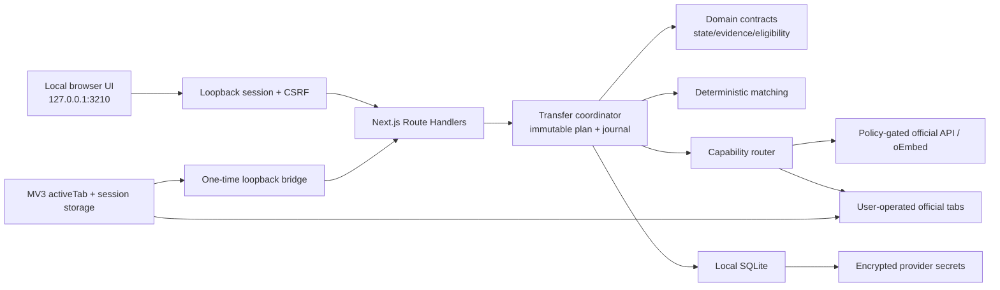
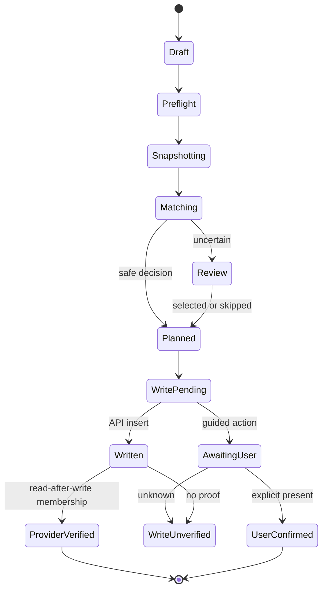

# Архитектура local-first edition

## Контекст

Приложение — single-user local Node/Next.js process с SQLite и отдельным MV3 guided shell. Hosting, SaaS control plane, внешняя БД, Redis, KMS и платные очереди не участвуют в обязательном пути.



## Модули репозитория

| Путь | Ответственность |
|---|---|
| `app/` | Next.js App Router UI, local Route Handlers, session boundary и user workflows |
| `apps/worker/` | Локальный coordinator runner для resumable transfer steps |
| `apps/extension/` | Chrome/Edge MV3 guided capture/navigation, без DOM automation |
| `packages/domain/` | Provider IDs, transfer modes/settings, eligibility, state machines, plan и honest evidence |
| `packages/matching/` | Нормализация, hypotheses, deterministic scoring, queries и safe/risky decision |
| `packages/connectors-core/` | Capability registry, policy gates, URL policy, oEmbed и guided action cards |
| `packages/connectors/youtube/` | Optional BYO OAuth/API adapter, quota-aware search/write/read-back |
| `packages/storage-local/` | SQLite schema, durable journal, receipts, handoffs, quota ledger и vault |
| `packages/security/` | Literal-loopback checks, session/CSRF/rate limits и one-time OAuth state |
| `packages/test-fixtures/`, `tests/` | Synthetic/provider-neutral fixtures и automated verification |

UI получает сериализуемые DTO. Provider tokens и raw database objects не передаются Client Components.

## Strategy router

Каждый provider публикует capabilities, а coordinator выбирает strategy per operation:

1. `api` — только бесплатный официальный путь, доступный этой локальной установке и явно открытый точным operator acknowledgement; YouTube API default — closed.
2. `guided` — точный URL/ID, official page и явное действие пользователя.
3. `dom-read`/`ui-write` — зарезервированы за отдельным положительным policy gate и отсутствуют в default release.

В release profile cross-provider YouTube API search и derived scoring заблокированы policy gate до запроса к provider-у: пользователь вручную собирает 3–5 official URL, сравнивает raw metadata и выбирает exact `videoId`. API, если оператор открыл его точным acknowledgement-флагом, остаётся для owned-source reads, записи уже выбранного ID и read-after-write. Ошибка quota/reauth переводит работу в manual watch-URL fallback без потери journal/decisions; это не quota bypass. Для Spotify baseline сразу guided. Любое направление с SoundCloud принудительно получает `forceGuided=true`: приложение не выполняет API/DOM mutation или автоматическое создание destination, но user-operated официальный link-out путь проходит до отдельной reconciliation и статуса `USER_CONFIRMED_MANUAL`. `SC-BASE-LEGAL=unknown` остаётся видимым ограничением и запрещает выдавать этот путь за approved automation.

## Transfer model

Три режима используют общий planner:

- `SEPARATE_COPY` — отдельный, созданный для transfer новый пустой destination на source playlist.
- `MERGE_NEW` — один созданный для transfer новый пустой destination для нескольких источников.
- `APPEND_EXISTING` — запись в реальный существующий destination после проверки его текущей версии/count.

Для первых двух режимов binding fail-closed требует `newPlaylistAttested=true`, ownership/edit-control attestations и видимый count ровно `0`; один и тот же playlist нельзя переиспользовать между планами `SEPARATE_COPY`. Перед каждым guided Add coordinator требует свежую сверку identity/count. Baseline равен исходному count для `APPEND_EXISTING` и `0` для новых destinations, после чего увеличивается только подтверждёнными receipts этого destination; unverified receipt делает baseline неоднозначным и требует ручной повторной сверки.

Planner связывает write item с реальным provider target:

- Spotify — track ID/URI.
- SoundCloud — permalink/URN, если официальный adapter его предоставил.
- YouTube — обязательный `videoId`.

Source hypotheses нужны только для поиска и сравнения. Они никогда не становятся fictitious destination entity.

## Matching settings

`SAFE`/`RISKY` — поле `riskMode`, а `reviewUncertain` — независимый boolean per transfer. Следовательно, одно приложение хранит четыре комбинации поведения. Где разрешён provider-validated derived matching, SAFE/RISKY выбирают разные guarded thresholds. В default policy-gated guided path review `on` переводит uncertain items в явную очередь, а review `off` переводит их в `SKIPPED_NOT_FOUND`; если selectable items нет, transfer завершается `PARTIAL` без пустого destination/write plan. Ручной выбор получает `SAFE_HUMAN_OVERRIDE` либо `RISKY_USER_SELECTED`, поэтому режим остаётся видимым в evidence, но не ослабляет provider gate.

Matching pipeline:

1. Нормализует Unicode/punctuation/feat markers без уничтожения исходных raw fields.
2. Строит несколько hypotheses для неточного source metadata.
3. Формирует provider-appropriate search query.
4. Проверяет реальный provider ID и evidence.
5. Считает deterministic title/artist/duration/version score.
6. Auto-select только при выполнении mode threshold; иначе review или skip.

Эти этапы выполняются только если более строгий provider policy gate разрешает derived matching. Для release-пар с Spotify/YouTube automatic cross-provider search/scoring не запускается: UI сохраняет ручной выбор точного ID без score и показывает provider metadata только при реальном official read-back. URL syntax alone хранит нейтральную метку target, `availability=UNKNOWN` и пустой набор provider metadata; source title не копируется в candidate. `SAFE`/`RISKY` и review остаются настройками одного приложения, но не могут ослабить policy gate.

Для Spotify/SoundCloud content запрещены LLM, embeddings, audio fingerprints и audio download/cache.

## Состояния и durable execution

Высокоуровневый job проходит draft/preflight/snapshot/matching/review/planning/writing/verification до completed/partial/failed. Item state хранится отдельно, поэтому uncertain или failed track не делает остальные «успешными».



Перед mutation создаётся immutable write plan и idempotency key, включающий transfer/source position/target/destination. Journal step имеет уникальный key. После ambiguous timeout coordinator сначала перечитывает destination или запрашивает user reconciliation; blind Add retry запрещён.

`APPEND_EXISTING` не выполняет автоматический rollback по умолчанию: destination мог параллельно изменить пользователь/collaborator.

## Evidence model

Receipt отделяет факт execution от качества verification:

- `VERIFIED_PROVIDER`: target ID подтверждён official read-back после write.
- `USER_CONFIRMED_MANUAL`: отдельное явное подтверждение пользователя после guided action.
- `WRITE_UNVERIFIED`: действие/результат неоднозначны.
- Error/skipped/in-progress — самостоятельные категории.

Report агрегирует категории раздельно. oEmbed или синтаксически валидный URL не повышаются до provider membership proof.

## Storage

SQLite работает с foreign keys, WAL и `synchronous=FULL`. Таблицы разделяют:

- local profile и service connections;
- playlist snapshots с source version/expiry;
- transfers/items/review decisions;
- immutable write receipts;
- resumable local job journal;
- one-time extension handoffs;
- quota ledger и redacted audit events.

Credentials шифруются local vault. Backup использует отдельную portable encrypted envelope. `Clear history` и `Delete account` имеют разный scope.

## Extension bridge

MV3 package не является scraping connector. Он:

1. Создаёт короткоживущий pairing invite после user action.
2. Связывается только с exact `http://127.0.0.1:3210/extension-bridge`.
3. Принимает typed versioned messages с issue time/request ID.
4. Захватывает URL активной вкладки по `activeTab` без чтения DOM.
5. Возвращает one-time handoff.
6. Показывает staged navigation, которую пользователь открывает отдельным click.

Данные находятся в `chrome.storage.session`, а extension CSP запрещает network connections. Provider OAuth tokens extension не получает.

## Playback/review

Official YouTube iframe может seek максимально близко к 25% после user gesture и должен оставаться видимым. Для Spotify/SoundCloud baseline используется attribution + sequential/link-out. Это намеренно не называется strict side-by-side comparison.

Strict comparison — внешний capability/policy gate: обе стороны пары должны иметь бесплатный official player path и письменное разрешение competitive presentation. Один разрешённый YouTube player этого условия не закрывает.

## Deployment boundary

Поддерживаемая baseline topology:

```text
one OS user -> one local Node process -> one local SQLite -> one browser profile
```

Не поддерживаются как часть этой редакции: public binding, remote clients, shared OAuth client, browser store distribution, hosted database, serverless runtime и multi-user auth. Если такой профиль появится позже, он требует отдельной архитектуры безопасности/policy, но не может стать обязательным для local build.
